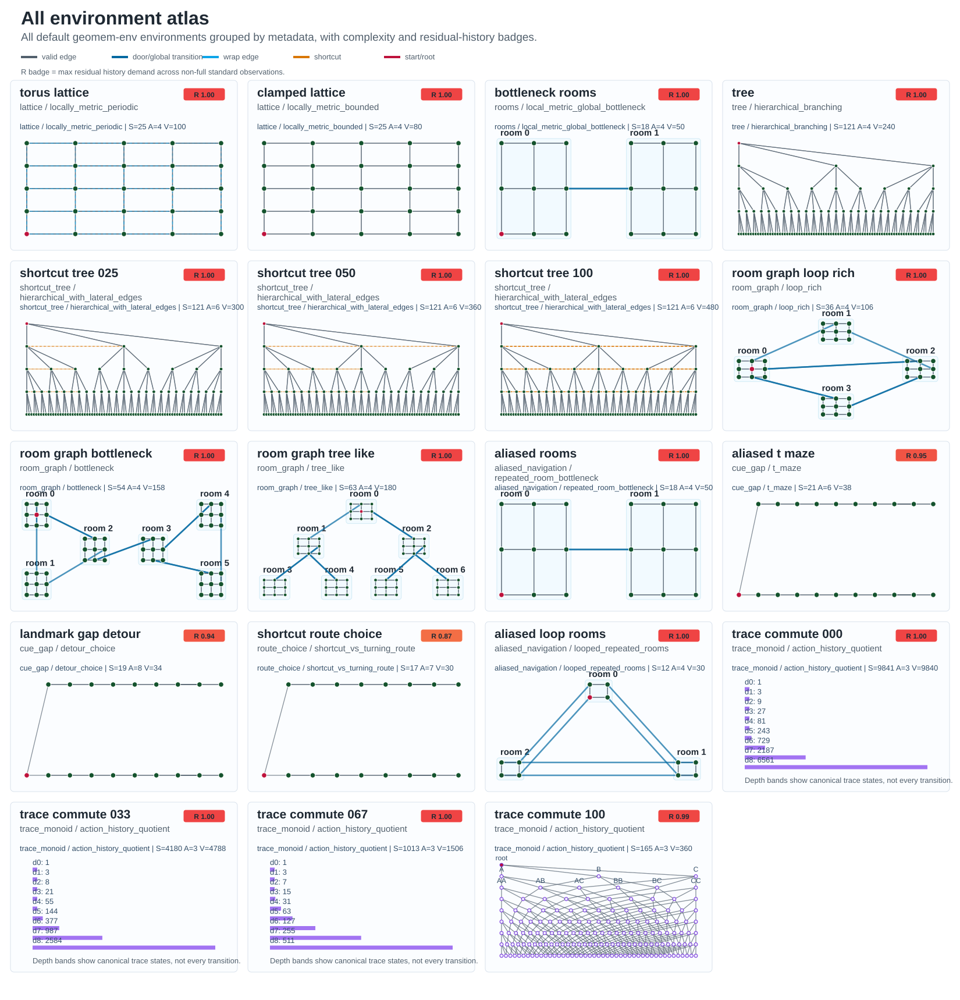

# GeoMem Environment Suite

This document presents the current `geomem-env` environment taxonomy and the figures that summarize it. The environments are finite-state diagnostic tasks. They are not intended to be realistic simulators by themselves; they isolate task-geometry variables that determine when memory can be compressed into compact state and when route, cue, branch, or latent-context history must remain explicit.

Generated figures live in `../geomem-experiments/figures/`.

Latent transitions and sensory observations are separated. The transition graph defines the task geometry; observation helpers and observation channels define what an agent can sense about the latent state.

## Reading The Figures

Each panel reports:

- `S`: number of latent states;
- `A`: number of actions;
- `V`: number of valid transitions;
- `R`: max residual history demand across non-full standard observation summaries.

`R` is computed from transition ambiguity and policy ambiguity. Low `R` means the observation summary is close to sufficient; high `R` means the observation can alias transition- or policy-relevant latent state.

Edge and node conventions:

- green nodes: latent states;
- red node: root or default start;
- gray edges: valid local transitions;
- blue edges: door or global room transitions;
- cyan dashed edges: periodic wrap transitions;
- orange dashed edges: shortcut transitions.

## Dynamics, Actions, And Observations

Every environment is a deterministic finite-state controlled system

$$
\mathcal{E} = (S, A, T, V, s_0)
$$

where `S` is the finite latent state set, `A` is the finite action set, `T`
maps a state-action pair to the next latent state, `V` is the set of valid
state-action pairs, and `s0` is a default start state or set of start states.
For state `s_t` and action `a_t`,

$$
s_{t+1} =
\begin{cases}
T(s_t, a_t), & (s_t, a_t) \in V \\
s_t, & (s_t, a_t) \notin V
\end{cases}
$$

Invalid or missing actions therefore act as self-loops under `env.step()`.
Use `env.is_valid(s, a)` or the validity flag returned by `env.rollout()` when
an experiment needs to distinguish intended motion from invalid self-loops.

Observations are separated from latent dynamics. The default realistic
interface is a Gaussian sensory channel: the environment maps the latent state
to an aliased current sensory prototype and adds observation noise. It does not
emit action history, valid-action masks, or learned action embeddings. An
observation channel is a map from latent state to agent input:

$$
o_t \sim O(\cdot \mid s_t)
$$

For exact observations this reduces to

$$
o_t = f(s_t)
$$

For noisy sensory observations,

$$
o_t = f(s_t) + \epsilon_t,
\qquad
\epsilon_t \sim \mathcal{N}(0, \sigma^2 I)
$$

The intended data flow is:

```text
latent state s_t
      |
      | action a_t
      v
transition rule T(s_t, a_t)
      |
      v
latent state s_{t+1}

observation channel O reads the latent state
and emits o_t for the agent.
```

This separation allows the same latent graph to be studied under full-state,
compressed, aliased, or noisy sensory observations.

For model-facing rollouts, the action stream is carried outside the environment:

```text
model input at t:      sensory observation o_t plus previous action token a_{t-1}
model output at t:     action a_t
environment input:     action a_t
environment output:    next sensory observation o_{t+1}
next model input:      o_{t+1} plus previous action token a_t
```

The previous-action token is instantaneous motor input. Any compression of
multiple past actions must be learned by the model's recurrent state, reservoir,
sequence mechanism, or explicit memory, not supplied by the environment.

## Action Rules

### Lattices

For lattice states `s = (x, y)` and actions `A = {N, S, E, W}`, the torus
lattice wraps at boundaries:

$$
\begin{aligned}
N(x,y) &= (x, (y+1) \bmod H), \\
S(x,y) &= (x, (y-1) \bmod H), \\
E(x,y) &= ((x+1) \bmod W, y), \\
W(x,y) &= ((x-1) \bmod W, y).
\end{aligned}
$$

The clamped lattice uses the same local actions, but boundary moves remain at
the boundary:

$$
\begin{aligned}
N(x,y) &= (x, \min(H-1, y+1)), \\
S(x,y) &= (x, \max(0, y-1)), \\
E(x,y) &= (\min(W-1, x+1), y), \\
W(x,y) &= (\max(0, x-1), y).
\end{aligned}
$$

Illustration:

```text
Torus:    right edge --E--> left edge
Clamped:  right edge --E--> same state
```

### Rooms And Room Graphs

Room states have the form `s = (room, x, y)`. Local motion within a room follows
the clamped lattice rule. Doorway states override local motion.

For two bottleneck rooms of side length `m`,

$$
D_{\mathrm{left}} = (0, m-1, \lfloor m/2 \rfloor),
\qquad
D_{\mathrm{right}} = (1, 0, \lfloor m/2 \rfloor)
$$

$$
T(D_{\mathrm{left}}, E) = D_{\mathrm{right}},
\qquad
T(D_{\mathrm{right}}, W) = D_{\mathrm{left}}
$$

Illustration:

```text
room 0                         room 1

+-----+                       +-----+
|     |                       |     |
|    D| --E-->         <--W-- |D    |
|     |                       |     |
+-----+                       +-----+
```

For factorized room graphs, a topology edge between rooms `i` and `j` creates a
paired doorway. If `port_i(j)` is the port assigned to room `j` from room `i`,
then

$$
T(\operatorname{door}(i, \operatorname{port}_i(j)), \operatorname{port}_i(j))
=
\operatorname{door}(j, \operatorname{port}_j(i))
$$

and the reverse transition is also valid.

### Trees And Shortcut Trees

Tree states are tuples of child choices. The root is `()`, and a depth-`k` node
is `(c1, ..., ck)`. With branching factor `b` and maximum depth `d`,

$$
A = \{C_0, \ldots, C_{b-1}, U\}
$$

Child actions descend when a child exists:

$$
T(s, C_i) =
\begin{cases}
s + (i), & |s| < d \\
s, & |s| \ge d
\end{cases}
$$

The parent action ascends unless the state is already the root:

$$
T(s, U) =
\begin{cases}
s_{1:|s|-1}, & |s| > 0 \\
(), & s = ()
\end{cases}
$$

Shortcut trees add lateral `L` and `R` actions between nodes at the same depth.
The `shortcut_density` parameter controls what fraction of these lateral edges
are active.

Illustration:

```text
        ()
      /  |  \
    C0   C1  C2
    /         \
 (0,0)       (2,0)

U moves upward.
C_i moves to child i.
L/R may connect same-depth nodes in shortcut trees.
```

### Trace Monoids

Trace states are canonicalized action histories:

$$
s = (a_1, a_2, \ldots, a_k)
$$

Taking an action appends a symbol and canonicalizes the resulting word:

$$
T(s, a) = \operatorname{canonicalize}(s + (a))
$$

Canonicalization swaps adjacent commuting actions into rank order. If actions
`A` and `B` commute, then

$$
AB = BA
$$

This gives a controlled quotient between fully order-sensitive sequence memory
and compressed count-like memory.

### Behavioral Navigation Tasks

Behavioral tasks use latent cue or route states:

$$
s = (\mathrm{cue}, \mathrm{stage})
\qquad\text{or}\qquad
s = (\mathrm{route}, \mathrm{stage})
$$

The cue is available early and may later be hidden by the observation channel.
For an aliased T-maze,

$$
\begin{aligned}
T((), C_c) &= (c, 0), \\
T((c,p), F) &= (c, p+1), \\
T((c,L-1), L) &= (c, L), \\
T((c,L-1), R) &= (c, L+1).
\end{aligned}
$$

The same local junction observation can require different choices depending on
the remembered cue.

Illustration:

```text
root --C0--> cue 0 corridor --F--> junction --L/R--> terminal
root --C1--> cue 1 corridor --F--> junction --L/R--> terminal

If the cue is hidden after the start, correct terminal choice requires memory.
```

## Observation Formulas

### Exact State Summaries

Full-state observation:

$$
o = s
$$

Room-only observation for `s = (room, x, y)`:

$$
o = \mathrm{room}
$$

Local-position observation:

$$
o = (x, y)
$$

Aliased room feature:

$$
o = (x + 2y) \bmod K
$$

This intentionally ignores room identity, so multiple rooms can share the same
observation.

Trace action-count observation:

$$
o_j = \sum_{i=1}^{|s|} \mathbf{1}[a_i = j]
$$

Trace depth observation:

$$
o = |s|
$$

Trace depth-plus-last-action observation:

$$
o = (|s|, \operatorname{last}(s))
$$

Local valid-action observation:

$$
o =
\left[
\mathbf{1}[(s,a_1)\in V],
\ldots,
\mathbf{1}[(s,a_n)\in V],
\operatorname{onehot}(\operatorname{sparse\_symbol}(s))
\right]
$$

### Noisy Sensory Observation Channels

Gaussian local sensory vectors normalize and pad a numeric encoding of the
latent state:

$$
b(s) = \operatorname{normalize}(\operatorname{pad}(s))
$$

$$
o = b(s) + \epsilon,
\qquad
\epsilon \sim \mathcal{N}(0, \sigma^2 I)
$$

Sparse visual features use a one-hot feature index. For room-like states,

$$
\phi(s) = (x + 2y) \bmod K,
\qquad
o = \operatorname{onehot}_K(\phi(s))
$$

With dropout probability `p`,

$$
o =
\begin{cases}
0, & \text{with probability } p \\
\operatorname{onehot}_K(\phi(s)), & \text{otherwise}
\end{cases}
$$

Egocentric noisy landmark observations concatenate local affordances with noisy
landmark evidence:

$$
o =
\left[
\mathrm{valid}_N,
\mathrm{valid}_E,
\mathrm{valid}_S,
\mathrm{valid}_W,
\ell_1 + \epsilon_1,
\ldots,
\ell_K + \epsilon_K
\right]
$$

where

$$
\mathrm{valid}_i = \mathbf{1}[(s,a_i)\in V],
\qquad
\ell = \operatorname{onehot}_K(\phi(s)),
\qquad
\epsilon_i \sim \mathcal{N}(0, \sigma^2)
$$

Example:

```text
true state:       (room=3, x=1, y=2)
full observation: (3, 1, 2)
aliased visual:   onehot((1 + 2*2) mod K)
egocentric:       [valid actions, noisy landmark features]
Gaussian:         normalized numeric state plus noise
```

## Complete Atlas



**Figure 1. Complete environment atlas.** All default `geomem-env` environments are shown with family/geometry labels and complexity badges. Small navigation-like environments occupy the controlled finite-state regime, while trace-monoid environments become large because they enumerate action-history quotients up to depth 8. The `R` badge highlights how much residual history remains under aliased or compressed observations.

## Formal Geometry Families


**Figure 2. Formal environment gallery.** These environments isolate core geometry variables. Torus and clamped lattices separate exact local commutativity from boundary effects. Bottleneck rooms mix local metric geometry with a global graph constraint. Shortcut trees test whether lateral graph edges are enough to reduce branch-order dependence. Trace-monoid panels show a controlled quotient from fully order-sensitive histories to count-like commutative state.

## Behavior-Facing Navigation Families


**Figure 3. Named navigation task gallery.** These tasks introduce observation aliasing, cue gaps, and route-dependent decisions while remaining small enough for exact diagnostics. Repeated-room tasks hide room identity behind local observations. Cue-gap tasks require retaining early information until a later choice. Route-choice tasks make the same local choice point depend on how it was reached.

## Factorized Room-Graph Families


**Figure 4. Factorized room-graph environments.** All room-graph tasks share the same local metric room structure, but vary global topology. `loop_rich` provides redundant paths and loops, `bottleneck` forces traffic through a bridge between clusters, and `tree_like` removes global cycles so branch identity and route history matter more strongly.

## Taxonomy Summary

| Family | Representative environments | Main variable isolated |
|---|---|---|
| `lattice` | `torus_lattice`, `clamped_lattice` | local metric state, boundary effects, loop closure |
| `rooms` | `bottleneck_rooms` | local metric geometry plus global bottleneck |
| `tree`, `shortcut_tree` | `tree`, `shortcut_tree_*` | branch history, hierarchy, lateral shortcuts |
| `room_graph` | `room_graph_loop_rich`, `room_graph_bottleneck`, `room_graph_tree_like` | fixed local room geometry with varied global topology |
| `aliased_navigation` | `aliased_rooms`, `aliased_loop_rooms` | hidden room identity under repeated local observations |
| `cue_gap` | `aliased_t_maze`, `landmark_gap_detour` | delayed cue memory and sensory gaps |
| `route_choice` | `shortcut_route_choice` | final policy depends on route history |
| `trace_monoid` | `trace_commute_000` through `trace_commute_100` | action-order quotient from sequence state to count state |

## Sensory Observation Channels

The package supports observation channels for environments where the input is
not action history:

- Gaussian sensory vectors: aliased current-state sensory prototypes with independent Gaussian noise. This is the default realistic channel.
- Gaussian local sensory vectors: coordinate-like state summaries with independent Gaussian noise.
- Sparse visual features: one-hot or dropped-out feature cues that intentionally alias multiple rooms or states.
- Egocentric noisy landmarks: valid-action affordance bits plus noisy landmark features. This is a control channel, because it gives local action affordances directly.

These channels are evaluated with sampled diagnostics rather than exact equality grouping. This keeps the latent task geometry fixed while testing whether noisy sensory evidence is sufficient for transition prediction or policy choice.

## Complexity Regimes

The current suite spans three practical regimes:

- Small controlled navigation tasks: roughly 12-63 states. These are useful for exact observation, transition, and policy ambiguity diagnostics.
- Medium tree and shortcut tasks: 121 states. These expose branch-order dependence and the limits of simple shortcut-based interpolation.
- Large formal trace tasks: 165-9,841 states at depth 8. These provide the cleanest manipulation of history compressibility through commutation relations.

## How To Regenerate

From `geomem-experiments`:

```bash
PYTHONDONTWRITEBYTECODE=1 PYTHONPATH=../geomem-env/src:experiments python3 experiments/environment_gallery.py
```

Expected outputs:

```text
figures/formal_environment_gallery.svg
figures/navigation_environment_gallery.svg
figures/room_graph_environment_gallery.svg
figures/all_environment_atlas.svg
```
