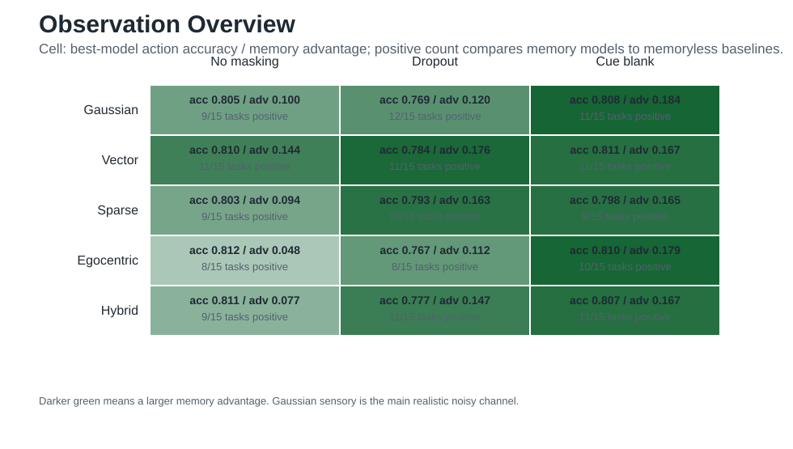
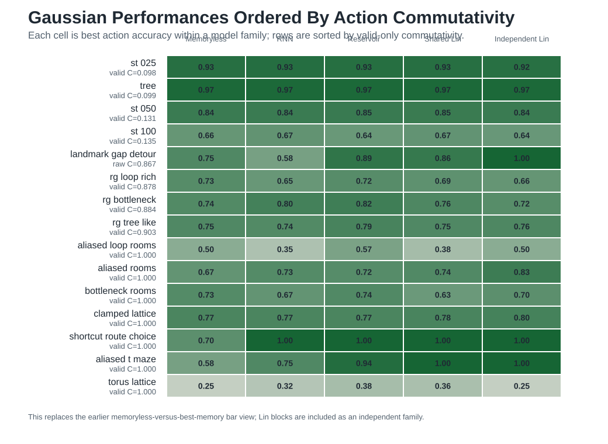
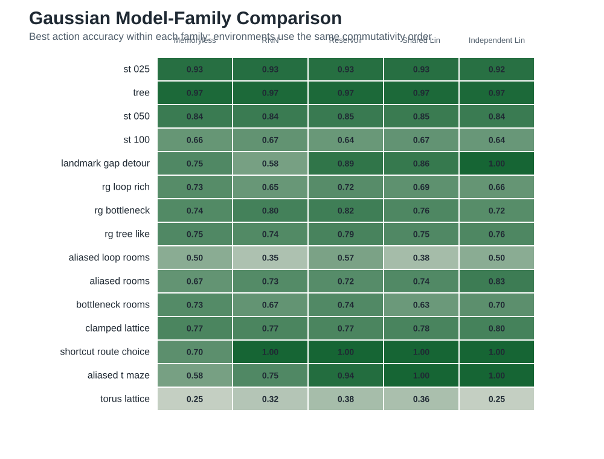
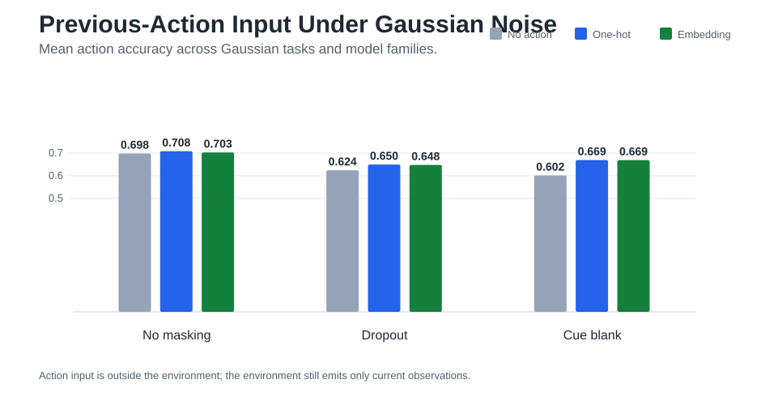
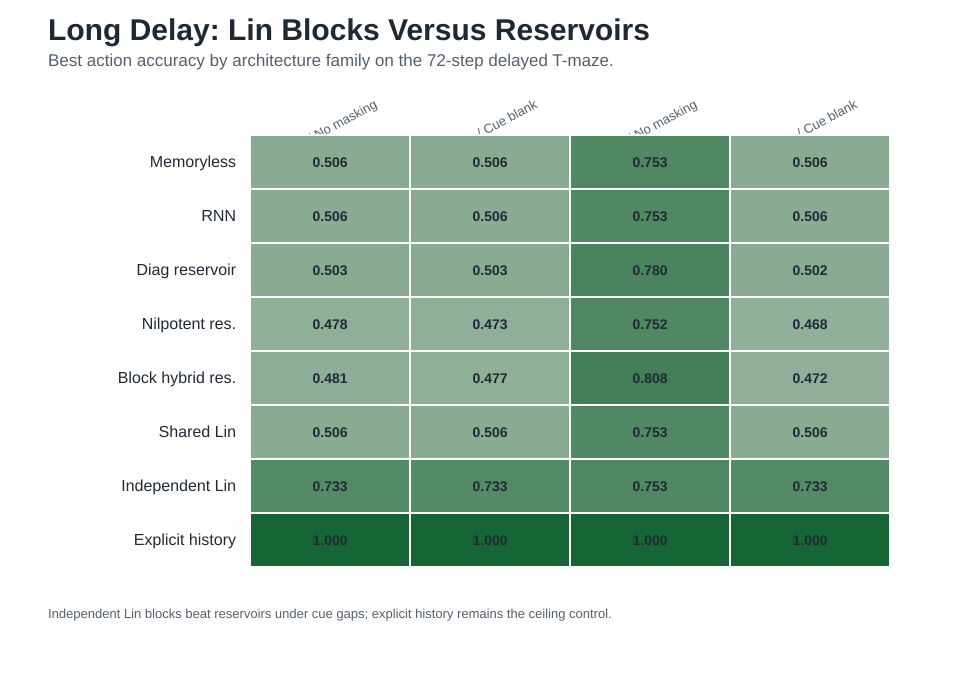

# Gaussian Navigation Results Summary

Date: 2026-05-29

## Reading Order

The updated results are easiest to evaluate if the experimental axes are kept separate:

1. `observation mode`: what the environment emits at the current time step.
2. `environment`: the latent transition system, ordered here by action commutativity.
3. `model`: how the learner uses, stores, or discards the input stream.
4. `performance measure`: what part of the behavior is being scored.

The main experiment is a memory experiment under a current-observation environment interface. The environment does not hand the model a state history. It emits the current observation `o_t`; memory is a property of the model.

## Concepts Before Results

At each step, the environment-side observation is only the current frame:

```text
environment interface:   current observation o_t
experiment input stream: o_t, goal observation, optional previous action a_{t-1}
model mechanism:         memoryless final-frame readout, recurrent state, reservoir state, or fixed sequence basis
```

The optional previous-action input is an experimental model input. It is not hidden environment state, and it is not a valid-action mask.

The observation modes are different encodings of the same current latent state:

- `gaussian_sensory`: the main noisy channel. The environment maps latent states to aliased sensory classes, maps each class to a fixed 8-dimensional prototype, then adds independent Gaussian noise with `sigma = 0.1`. It does not include valid-action bits or action history.
- `vector`: compact normalized numeric state coordinates or counts.
- `sparse_aliased`: a one-hot local symbol from a small aliasing alphabet; multiple latent states intentionally share symbols.
- `egocentric_landmark`: local valid-action affordance bits concatenated with the sparse aliased symbol. This gives the model more immediate local structure than `sparse_aliased`.
- `hybrid`: concatenation of `vector` and `sparse_aliased`.

The CSV column `temporal_mode` is better read as an observation availability schedule:

- `temporal_full`: every current observation `o_t` is visible.
- `temporal_dropout`: current observations are randomly masked with probability `0.5`.
- `temporal_cue_then_blank`: only the first two current observations are visible; later current observations are masked.

There is no separate "history visible" temporal mode in the main benchmark. The difference is model-side: `memoryless_*` is the final-frame-only baseline, while recurrent, reservoir, and Lin-sequence models process the same per-step stream and may retain information internally. Explicit history is a separate control, not what `temporal_full` means.

## 1. Observation Mode

Across observation modes, the best model per task is usually near `0.75-0.81` mean action accuracy, but the memory advantage changes with how much history the observation channel hides. Gaussian sensory is the key case because it combines continuous noise with deliberate aliasing.



For `gaussian_sensory`, the mean advantage of the best memory-bearing model over the best memoryless baseline is:

```text
temporal_full             +0.100, positive on  9/15 tasks
temporal_dropout          +0.120, positive on 12/15 tasks
temporal_cue_then_blank   +0.184, positive on 11/15 tasks
```

This is the first important result. Even when every time step provides a current noisy observation, memory improves many Gaussian tasks. When observations are dropped or blanked after a cue, the advantage increases.

The controls behave as expected. `egocentric_landmark` and `hybrid` can be easier in no-masking regimes because they expose more local structure. `sparse_aliased` and `gaussian_sensory` are more diagnostic for memory because distinct latent states can share the same visible evidence.

## 2. Environment, Ordered By Action Commutativity

The environments below are ordered by `effective_commutativity(valid_only=True)` where possible, with raw commutativity used only when the valid-only score is undefined. The score estimates how often swapping action order preserves the final state across sampled action strings. Low values indicate order-sensitive dynamics; high values indicate more locally commutative dynamics.



This figure now shows the full family-level performance pattern, not only the best memory model:

- Low-commutativity tree and shortcut-tree tasks are not uniformly hard. `shortcut_tree_025`, `tree`, and `shortcut_tree_050` are high across most families, while `shortcut_tree_100` separates families more clearly.
- Mid-range room-graph tasks still tend to favor reservoirs. `room_graph_bottleneck` reaches `0.823` with reservoirs versus `0.740` for memoryless and `0.719` for independent Lin blocks.
- Some delayed-choice tasks favor independent Lin blocks. `landmark_gap_detour` reaches `1.000` with independent Lin blocks, above reservoirs at `0.889` and shared Lin sequence at `0.861`.
- High valid-only commutativity does not mean the observation is easy. `aliased_t_maze` and `shortcut_route_choice` both reach `1.000` with sequence-like families while memoryless baselines remain lower.
- `torus_lattice` is the counterexample that prevents overinterpreting commutativity alone. It is maximally commutative, but Gaussian sensory plus goal/action ambiguity leaves the best memory-bearing model at `0.379`.

So commutativity is useful as an ordering variable, not as a complete explanation. The relevant difficulty is the interaction of transition geometry, sensory aliasing, and whether the optimal action depends on unobserved history.

## 3. Model Family

The model comparison should be read within the same environment and observation schedule. For the main Gaussian no-masking condition, the best model family changes across environments.



Mean best-in-family action accuracy across the 15 Gaussian `temporal_full` tasks is:

```text
memoryless final-frame baselines     0.705
trained RNN                          0.719
shared Lin sequence                  0.759
independent Lin block                0.773
reservoirs                           0.783
```

The task-level winners are heterogeneous. `reservoir_diagonal` wins 6/15 Gaussian no-masking tasks, independent Lin blocks win 6/15 after the backfill, and `numpy_rnn` wins two shortcut-tree settings. This is the second important result: there is no architecture that cleanly dominates every geometry.

The distinction between `shared Lin sequence` and `independent Lin block` matters. Shared Lin sequence uses a shared finite sequence basis; independent Lin block gives each input feature its own finite chain. The backfilled main benchmark shows independent Lin blocks can match or exceed the other families on cue/route tasks, while reservoirs remain stronger on several room-graph and lattice-like settings.

## 4. Performance Measures

The primary score is `action_accuracy_mean`: supervised next-action accuracy averaged over runs for a fixed task, observation mode, temporal schedule, action input, and model.

Other reported measures answer different questions:

- `action_accuracy_sem`: uncertainty across runs for the supervised action score.
- `greedy_success_mean`: rollout success when the learned predictor is used greedily from test starts to goals.
- `context_accuracy_mean`: auxiliary context/cue classification accuracy where the dataset exposes such labels.
- `memory_advantage`: best memory-bearing action accuracy minus best memoryless action accuracy within the same condition.
- `n_runs`: number of repeated runs contributing to a summary row.

The weight-analysis CSV adds model diagnostics rather than behavioral scores: `spectral_radius`, `effective_rank`, `power_decay_10`, `nilpotent_score`, `oscillatory_score`, `normality_index`, and related matrix summaries. These are useful for interpreting reservoir and sequence mechanisms, but the report's main claims are based on action accuracy, memory advantage, and rollout success.

The Lin-block backfill recomputes action accuracy and leaves Lin-block `greedy_success_mean` and `context_accuracy_mean` undefined. This keeps the missing architecture comparisons focused on supervised action performance, which is the metric shown in the section 2 and section 3 figures.

## Detailed Effects

Under Gaussian observations, previous-action input helps most when the current observation stream is sparse. The focused Gaussian ablation compares no action input, one-hot previous action, and fixed dense action embeddings.



Mean action accuracy over the focused Gaussian run:

```text
temporal_full:
  no action input      0.698
  one-hot action       0.708
  dense embedding      0.703

temporal_dropout:
  no action input      0.624
  one-hot action       0.650
  dense embedding      0.648

temporal_cue_then_blank:
  no action input      0.602
  one-hot action       0.669
  dense embedding      0.669
```

The useful contrast is not one-hot versus embedding; those are close. The useful contrast is action stream versus no action stream, especially after the visual cue disappears.

The long delayed-cue controls isolate span-matched memory. Here the independent Lin block is much stronger than reservoirs under cue gaps, but explicit observed history remains the ceiling.



On the 72-step delayed T-maze:

```text
sparse_aliased / temporal_cue_then_blank:
  memoryless_linear       0.506
  reservoir_diagonal      0.503
  reservoir_block_hybrid  0.477
  shared Lin sequence     0.506
  independent Lin block   0.733
  explicit history h80    1.000

egocentric_landmark / temporal_cue_then_blank:
  memoryless_linear       0.506
  reservoir_diagonal      0.502
  reservoir_block_hybrid  0.472
  shared Lin sequence     0.506
  independent Lin block   0.733
  explicit history h80    1.000
```

This clarifies the Lin-block result. Reservoirs are strong in several Gaussian navigation environments, especially the room-graph and lattice-like settings. But for a clean long-delay cue task, independent finite chains recover much more of the missing cue than the tested reservoirs or shared Lin sequence.

## Main Takeaways

The updated experiments support a more precise claim:

```text
When the environment emits only current noisy observations, model-side memory becomes useful whenever the optimal action depends on aliased, dropped, or temporally separated evidence.
```

Gaussian sensory observations are the strongest paper-facing condition because they avoid giving the model a symbolic latent state while still preserving controlled aliasing. The results show three consistent effects: memory advantage rises as current observations become less available, previous-action input matters most under cue gaps, and the best memory mechanism depends on the environment geometry.

## Artifacts

Primary CSV outputs:

- `../figures/rnn_navigation_summary.csv`
- `../figures/rnn_memory_advantage.csv`
- `../figures/rnn_gaussian_updated_summary.csv`
- `../figures/rnn_gaussian_updated_memory_advantage.csv`
- `../figures/rnn_lin_long_architecture_families.csv`
- `../figures/rnn_weight_analysis.csv`

The main and focused benchmark CSVs were backfilled with `lin_block_*` rows using `backfill_lin_block_results.py`. Summary figures are generated by `plot_gaussian_results_summary.py`.

## Caveats

These are supervised imitation benchmarks over generated navigation trajectories, not reinforcement-learning experiments. Absolute accuracies should be interpreted as architecture and representation diagnostics. The strongest comparisons are within the same task, observation mode, temporal schedule, action-input condition, and metric.
