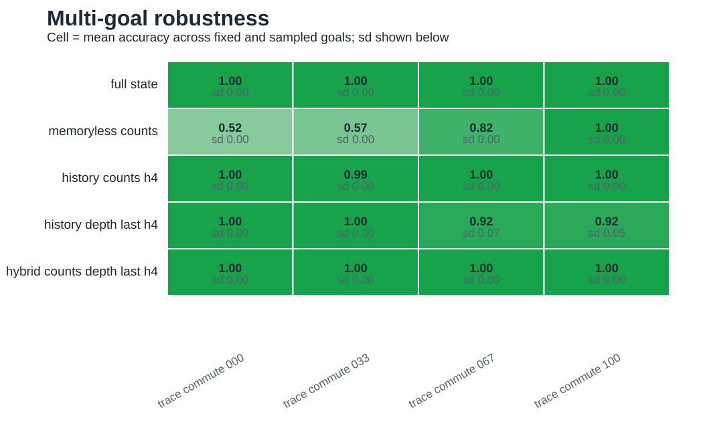
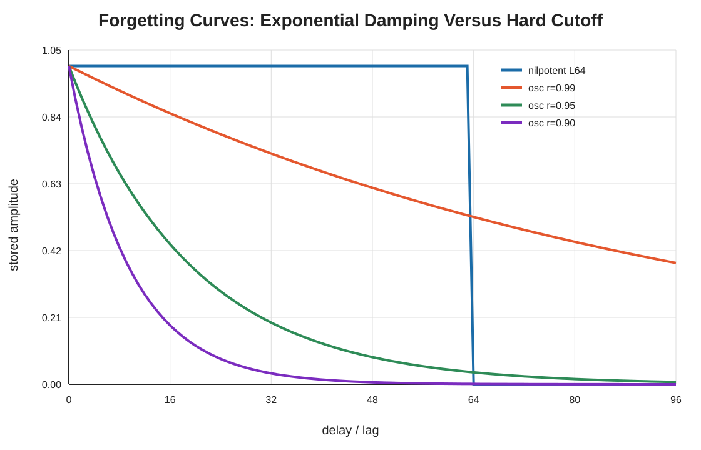
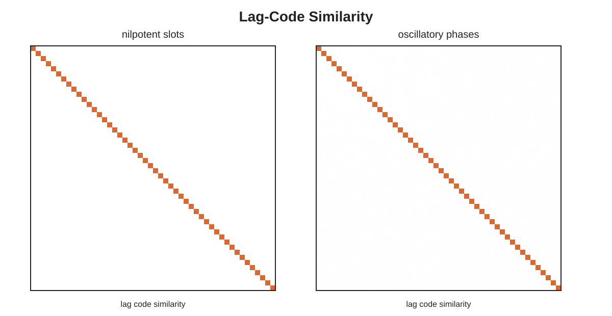
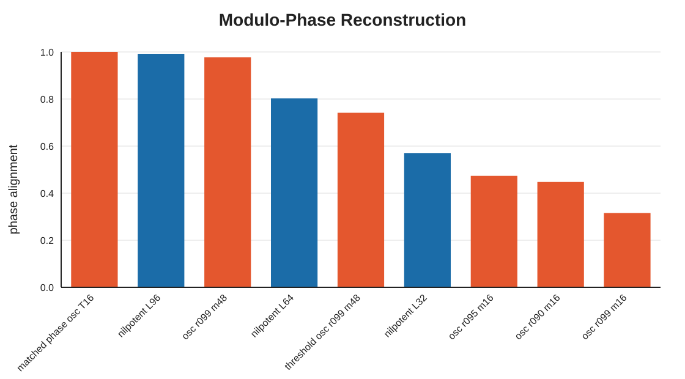

# GeoMem: Task Geometry And Observations Determine Navigation Memory Demand

## Abstract

Navigation and sequential decision-making require memory, but the useful memory content should depend on which action-observation histories remain relevant for control. GeoMem frames this dependence as task-relevant history compression. In commutative or locally integrable regimes, ordered histories can collapse into vector, count, or path-integration-like local state. When geometry and observations preserve policy-relevant route, cue, or latent-context distinctions after that compression, residual sequence, graph, clone-state, belief-like, or hybrid memory is needed. We use trace-monoid navigation tasks as an exact algebraic control over action commutativity, then test navigation-facing consequences in room-graph and delayed-cue supervised tasks. Across ambiguity diagnostics, shortest-path policy analysis, multi-goal benchmarks, and a lightweight cost-aware selector, count memory is Markov- and policy-sufficient in the fully commutative trace limit but fails in tested order-sensitive trace regimes where same-count histories require different futures or actions. The framework motivates a hybrid hippocampal-entorhinal interpretation: local metric codes can compress integrable state, while hippocampal sequence and relational mechanisms can preserve residual route or context information under intrinsically sparse or aliased observations, or under a DG-like sparsified code fed into the sequence system.

## 1. Introduction

The hippocampal-entorhinal system supports path integration, spatial maps, replay, sequence memory, relational inference, and abstract structure learning. Existing theories emphasize different parts of this space. Path-integration and grid-cell theories explain compact metric updating. Cognitive graph accounts emphasize route structure. Successor representations describe predictive occupancy. TEM-like models emphasize structural generalization. Sequence-centric accounts propose that spatial maps can emerge from latent higher-order sequence learning.

GeoMem asks a different question: when should each memory content be useful for navigation? The central claim is that geometry and observations jointly determine which history distinctions survive task-relevant compression. In locally integrable, well-observed regimes, action history can collapse into compact metric state. In route-dependent or aliased regimes, local metric summaries can still leave residual branch, cue, or latent-context distinctions that matter for control. Mixed tasks should therefore favor hybrid content: compact local state together with memory for the residual route or context variable. Separately, a DG-like front end can sparsify a dense noisy stream before the sequence system sees it, which is a different mechanism from an environment that is intrinsically sparse or aliased.

This extends Lin, Yiu, and Leibold 2026. Their hippocampus-inspired sequence generator helps egocentric visual navigation after DG-like sparsification of the sensory stream. GeoMem adds a geometry axis to that code-level result: a sequence-memory advantage should grow when intrinsically sparse or aliased observations coexist with route or context distinctions not captured by local metric state, and it should also appear when a DG-like front end turns a dense noisy stream into a sparse, cleaner code before sequence memory. The effect should shrink when dense observations already expose a policy-sufficient state.

## 2. Theory

Let `h_t` denote the action-observation history available at time `t`, and let a memory representation be `m_t = f(h_t)`. The task induces a quotient over histories: histories may be merged only when the distinctions removed by `f` are irrelevant for the prediction or control criterion under study. We use Markov sufficiency to ask whether the compressed memory has unambiguous task transitions, and goal-conditioned policy sufficiency to ask whether histories merged by the memory still admit the same optimal decisions. Distinct latent states need not be stored when the observation regime and goal family make those distinctions behaviorally irrelevant.

Geometry enters through path equivalence. The controlled algebraic variable in the formal tasks is effective commutativity: whether action strings such as `AB` and `BA` lead to equivalent task states. Observation structure enters separately through dense state evidence, sparse cue gaps, and aliasing. A noncommutative latent geometry can still become easy when current observations resolve the relevant state; a commutative local geometry can still require memory when delayed cues or aliasing hide a policy-relevant variable.

This assigns action history a limited but important role. Action-history quotients formalize the geometry of control paths: which paths the task treats as equivalent, and which residual order distinctions remain after local path compression. They are not intended as a replacement for the dominant sensory stream in realistic organisms or visual agents. A path-integration-like state is one possible compression of action and self-motion history; a sensory emission channel supplies separate evidence about latent state.

The architecture-selection rule is:

> Select the lowest-cost memory representation that preserves the task-relevant history quotient under the geometry, observation regime, and goal family.

This rule separates memory content from memory mechanism. The current diagnostics and lightweight benchmarks test which information must be available. Recurrent and hippocampus-inspired agents test a different question: which dynamics learn and maintain that information efficiently. The current cost-aware selector uses feature width as a practical cost proxy, so stronger optimality claims require an explicit cost model and admissible architecture class.

The mixed navigation regime is central. Write a latent state schematically as `s = (x, q)`, where `x` is locally metric state within a room, corridor, or chart and `q` is residual route, branch, cue, or latent-context state. Local actions can update `x` compositionally, while bottlenecks, repeated rooms, cue gaps, or aliased portals can make `q` depend on history. Path-integration-like memory targets `x`; sequence, graph, clone-state, or belief-like memory targets residual dependence in `q`. Hybrid memory is principled when the task-relevant quotient decomposes well enough for those factors to be preserved separately.

The theory predicts the following regimes:

| Geometry and observations                           | Expected memory content                                      |
| --------------------------------------------------- | ------------------------------------------------------------ |
| local metric structure, dense state evidence        | compact metric/vector state                                  |
| local metric structure, sparse delayed evidence     | metric state plus cue-span memory                            |
| route-dependent latent paths, full state evidence   | current state may suffice                                    |
| route-dependent or aliased paths, sparse input      | residual sequence, graph, clone-state, or belief-like memory |
| mixed local metric patches and global route context | hybrid metric plus route/context memory                      |
| nested dependency                                   | stack-like memory                                            |

The formal package makes four paper-facing statements. In the fully commutative bounded trace limit, action counts identify the trace state and its valid navigation transitions. Any additive action summary merges same-multiset histories and therefore fails when those histories require incompatible goal actions. For a mixed state `s = (x, q)`, hybrid memory is policy-sufficient when the goal-conditioned policy quotient factorizes through a metric summary of `x` and a residual route/context summary of `q`. In balanced cue-gap tasks, a finite action-observation window shorter than the cue-decision gap is chance-limited when the later window carries no cue information. Full definitions and proofs are in `theory_appendix.md`.

## 3. Methods

We use trace-monoid navigation tasks as a controlled formal backbone. States are canonicalized action histories over actions `A`, `B`, and `C`. In the fully noncommutative task, all ordered histories remain distinct. In the fully commutative task, histories collapse to action counts. Intermediate tasks allow selected action pairs to commute. Valid append actions are evaluated below the finite maximum depth; boundary self-loops are not counted in the valid-only formal commutativity and transition diagnostics. These tasks isolate the algebraic order-collapse limit as a geometry diagnostic; they do not model a realistic visual observation stream. The room-graph tasks instantiate the mixed local-metric/global-route regime in a more navigation-like family.


We evaluate five levels of evidence.

First, effective commutativity measures whether action reordering preserves latent state. Second, emission ambiguity measures how many latent states share the same emitted summary or sensory observation. Third, transition ambiguity asks whether a summary-or-observation and action pair leads to multiple possible next states. Fourth, policy-set ambiguity asks whether aliased states preserve the tied shortest-path optimal-action set. Fifth, lightweight supervised benchmarks compare memoryless, finite-history, hybrid, and full-state representations over multiple goals.

The trace diagnostics call the following emitted variables observation modes in the implementation, but the distinction matters: `counts`, `depth_last`, and `depth` are controlled action-history summaries used to test path compression. The room-graph and delayed-cue regimes begin the sensory-emission side of the project; the planned visual extension is needed for realistic egocentric observations.

The trace observation modes are:

- `full`: full latent state;
- `counts`: action counts, used as the vector/coordinate-like representation;
- `noisy_counts`: degraded count observations;
- `depth_last`: depth plus last action;
- `depth`: depth only.

The architecture-selection analysis uses the multi-goal lookup benchmark and chooses the lowest-cost representation that reaches a target optimal-action accuracy. Costs are feature widths: memoryless counts cost 3, count history of length `h` costs `3h`, and hybrid counts plus depth-last history of length `h` costs `3 + 2h`.

For environments beyond exact trace quotients, the geometry diagnostic should broaden from trace commutativity to local action reorderability, path-compression ambiguity, and policy-relevant route residual measured on transition graphs or privileged simulator task state. Sensory recoverability should be evaluated separately from that geometry measurement.

## 4. Results

### 4.1 Trace Geometry Controls History Compressibility

Valid-only commutativity increases as more action pairs commute:


```text
trace_commute_000   0.000
trace_commute_033   0.264
trace_commute_067   0.534
trace_commute_100   1.000
```

Shortcut trees did not provide a clean interpolation because lateral shortcuts do not automatically create path equivalence. This negative result justifies using trace-monoid tasks as the formal control.

### 4.2 Count Summaries Are Sufficient Only When Order Does Not Matter

Count summaries ignore action order. They are complete in the fully commuting task and ambiguous otherwise:


```text
environment         mean_candidates   retained_entropy
trace_commute_000   251.11            0.447
trace_commute_033    93.94            0.504
trace_commute_067    23.74            0.619
trace_commute_100     1.00            1.000
```

Transition ambiguity shows that the same count summary and action can imply many different latent next states in noncommutative tasks:


```text
environment         mean_next_candidates   ambiguous_fraction
trace_commute_000   95.55                  0.993
trace_commute_033   41.17                  0.973
trace_commute_067   12.90                  0.873
trace_commute_100    1.00                  0.000
```

Thus, in these order-sensitive trace tasks, count memory is not merely lossy; it fails to define a Markov state.

### 4.3 Aliased Count Summaries Change Optimal-Action Sets

Goal-conditioned policy-set ambiguity closes the pre-agent control loop by asking whether count aliases preserve the tied shortest-path optimal-action set:


```text
environment         weighted_policy_ambiguity(counts)
trace_commute_000   0.997
trace_commute_033   0.987
trace_commute_067   0.920
trace_commute_100   0.000
```

For the tested goal-conditioned trace policies, the same count summary can alias histories whose shortest-path optimal-action sets differ when order-sensitive distinctions survive. Policy-set mismatch is not identical to strict policy conflict under ties; the multi-goal optimal-action lookup benchmark below tests whether a shared readout can remain optimal. In the fully commutative trace condition, count state is policy-sufficient.

### 4.4 Multi-Goal Benchmarks Support The Architecture Ranking

Across nine goals per environment, count/vector policy sufficiency increases with commutativity:



```text
environment         memoryless_counts   history_depth_last_h4   hybrid_h4
trace_commute_000   0.517               1.000                   1.000
trace_commute_033   0.573               0.998                   0.996
trace_commute_067   0.823               0.925                   1.000
trace_commute_100   1.000               0.920                   1.000
```

Finite-history and hybrid representations rescue the tested order-sensitive regimes. The `depth_last` cue is unusually strong in low-commutativity shortest-path tasks because it often identifies the route-reversal action, so it should be interpreted as a route cue rather than as a generic sparse sensory baseline.


### 4.5 The Lowest-Cost Sufficient Diagnostic Representation Depends On Geometry

At the 0.95 accuracy threshold, the cost-aware selector chooses:


```text
environment         conservative_counts   cost   hybrid_allowed               cost
trace_commute_000   history_counts_h2      6      hybrid_counts_depth_last_h1  5
trace_commute_033   history_counts_h4     12      hybrid_counts_depth_last_h2  7
trace_commute_067   history_counts_h2      6      hybrid_counts_depth_last_h1  5
trace_commute_100   memoryless_counts      3      memoryless_counts            3
```

This is the direct representation-selection result under the feature-width cost proxy. In the fully commutative task, memoryless counts are sufficient at the lowest tested cost. In tested order-sensitive tasks, the selector shifts to finite history or hybrid memory. In partial-commutation tasks, hybrid memory can reduce that proxy cost relative to storing count histories alone.

### 4.6 Systematic Supervised Navigation Sweeps

We next converted the generated geometries into goal-conditioned imitation-learning tasks. Each training example contains an observation history to the current state, a goal observation, and a shortest-path optimal action. This is not full RL; it isolates whether a memory architecture can learn the policy once optimal supervision is available.

The main learned comparison now uses a rooms-on-graph family rather than relying only on named behavioral examples. Locally metric rooms are connected by loop-rich, bottleneck, or tree-like global graphs. The sweep crosses global topology with low versus high observation aliasing and persistent versus cue-gap input, and compares memoryless, explicit-history, hybrid vector-plus-history, small RNN, representative reservoir, and independent Lin-block readouts. Under high aliasing and cue gaps, the hybrid readout improves policy accuracy on observation-aliased test decisions from `0.474` to `0.593` in loop-rich graphs, from `0.616` to `0.709` in bottleneck graphs, and from `0.330` to `0.544` in tree-like graphs.


The earlier behavioral tasks remain useful controls: repeated rooms, delayed landmark choice, landmark-gap detours, and shortcut-route choices make the route-memory demand legible. Those runs also motivate a structured sequence comparison with Lin-style active width `R`, propagation depth `L`, and total span `ell = R + L - 1`. The paper-facing Lin bridge is now a delay-by-span sweep. The sparse cue-then-blank condition exposes cue identity at entry and removes later cue features through the corridor; directed forward actions before the choice are matched across cue branches, so a short terminal window does not leak cue identity. A dense visible-state memoryless readout solves every tested delayed T-maze at `1.000`, whereas sparse cue-gap inputs require memory span that reaches the delayed cue. At `D = 64`, explicit history `H = 64` reaches `1.000` and the independent `R = 3`, `L = 64` Lin block reaches `0.993`. At `D = 80`, those partial-span conditions fall to `0.647` and `0.663`, while `H = 80` and `R = 3`, `L = 80` recover `1.000` and `0.995`.

These sweeps support the mechanism-level prediction in a limited supervised setting: memory advantages track topology, aliasing, and the span of policy-relevant delayed evidence. They do not yet establish full reward-driven navigation learning.


### 4.7 Temporal Basis Controls

The reservoir comparison motivates a more specific theory control: nilpotent and oscillatory memories can both preserve information, but they index time differently. A contractive oscillatory mode has envelope

$$
r^k
$$

giving exponential forgetting, whereas a nilpotent delay line preserves lag slots inside its span and then cuts off sharply.





In a delayed sparse-cue task with distractors, nilpotent delay lines show the predicted span boundary: they solve the task inside the finite window and drop to chance once the cue leaves the chain. Oscillatory banks can still solve the task when enough modes are available; `osc_r099_m48` reaches `1.000` at delay `64` and `0.918` at delay `96`. Thus the claim is not that oscillatory reservoirs lack memory, but that exact finite lag addressing is the native basis of nilpotent/Lin-block memory.


The converse appears in a modulo-phase reconstruction control. A matched two-dimensional oscillator reaches cosine alignment `0.9999`, whereas nilpotent memory needs enough explicit lag slots to represent the full tested range. This supports the basis-alignment interpretation: finite cue gaps favor lag-addressed memory, while phase or cyclic variables favor oscillatory memory.



## 5. Biological Interpretation

GeoMem does not claim a one-to-one anatomical mapping. It proposes a computational division of labor. Entorhinal/grid/path-integration systems are candidates for compressing local metric state. Hippocampal sequence and relational mechanisms are candidates for preserving residual route or context information when observations are sparse, aliased, or separated from later decisions. Hybrid hippocampal-entorhinal memory is therefore a plausible interpretation for navigation tasks that mix local metric structure with global route or context dependence.

| Task manipulation          | Predicted memory demand                                                | Hippocampal perturbation                         | Entorhinal/path-integration perturbation             |
| -------------------------- | ---------------------------------------------------------------------- | ------------------------------------------------ | ---------------------------------------------------- |
| dense local metric arena   | vector/path-integration                                                | mild impairment unless replay planning is needed | strong metric updating impairment                    |
| sparse landmarks           | hybrid metric plus sequence buffer                                     | impairment grows with sparsity                   | impairment if self-motion bridges gaps               |
| bottleneck maze            | local metric plus route context                                        | impaired bottleneck disambiguation               | impaired local metric estimates                      |
| tree-like route task       | residual route/context memory when cues do not identify branch history | strong impairment when branch history matters    | weaker unless displacement cues matter               |
| aliased repeated corridors | clone-state or episodic sequence memory                                | strong context-disambiguation impairment         | depends on metric cue reliability                    |
| fully commutative task     | count/vector memory                                                    | limited impairment if vector state is available  | strong impairment if vector state must be integrated |
| partial-commutation task   | hybrid memory                                                          | selective impairment on route distinctions       | selective impairment on metric dimensions            |

## 6. Relation To Prior Work

Path integration explains local metric updating but does not specify when that compression ceases to be task-sufficient. Cognitive graph theories explain route structure but not when graph memory is required over local metric state. Successor representations describe predictive state occupancy but do not by themselves select the memory content that must survive partial observation. TEM and related models explain structural generalization, while sequence-centric accounts show how spatial structure can emerge from higher-order temporal learning. GeoMem complements these accounts by proposing a selection rule across task regimes: which history distinctions should remain in memory before a predictive, relational, or sequence mechanism supports control?

The closest lab anchor is Lin, Yiu, and Leibold 2026. GeoMem predicts that their sequence-generator advantage should be largest when sparse input leaves route or context distinctions unresolved by local metric state, and weakest when dense observations already provide a policy-sufficient current state.

## 7. Limitations And Next Experiments

The current work is best framed as a theory and diagnostic paper with a lightweight supervised recurrent-control benchmark. The benchmarks use shortest-path labels, directed delayed-choice labels, lightweight classifiers, and RNN/reservoir/structured-sequence comparisons; they are not yet hippocampus-inspired actor-critic agents.

The next stage should add:

- a full RL actor-critic benchmark using a hippocampus-inspired sequence generator;
- continuous egocentric visual input rather than symbolic or lightweight egocentric-landmark features;
- perturbation experiments comparing sequence-memory ablation and path-integration/vector-memory ablation;
- direct comparison with the Lin/Yiu/Leibold 2026 architecture.

## 8. Conclusion

Navigation memory demand depends jointly on geometry, observations, and goals. When the task quotient collapses path history into local state, vector-like summaries can be sufficient. When compression leaves policy-relevant route, cue, or latent-context distinctions unresolved, residual history or relational memory must remain available. Mixed local-metric/global-route tasks therefore motivate hybrid memory content. The current results establish this claim in controlled algebraic diagnostics and lightweight supervised navigation controls, and they define the task regimes in which a biological hippocampal-entorhinal comparison should be tested next.
