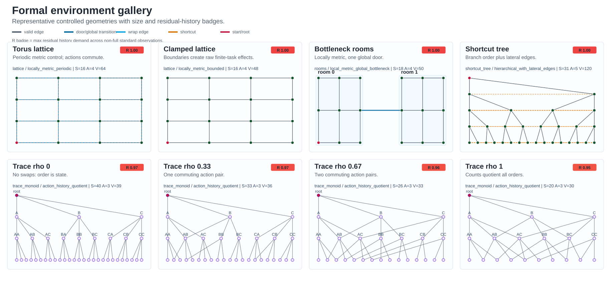
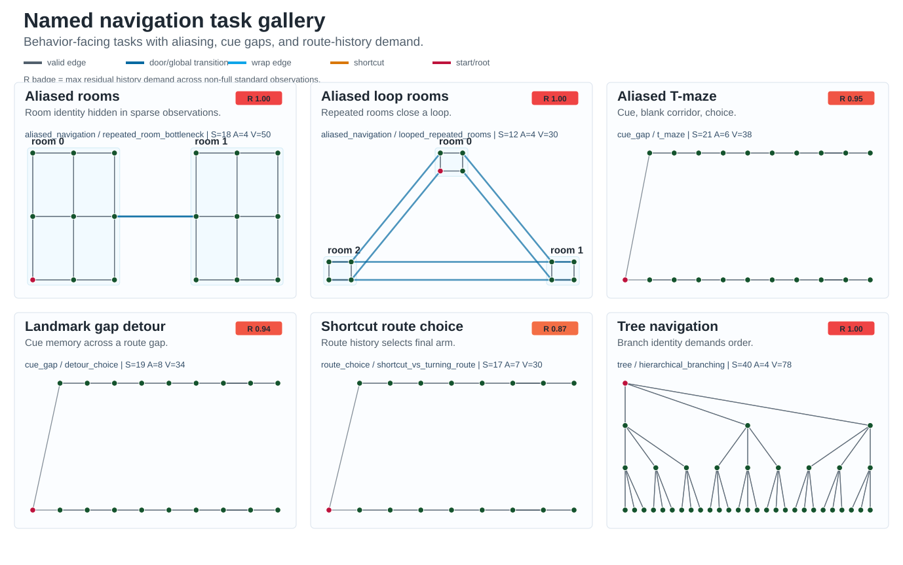
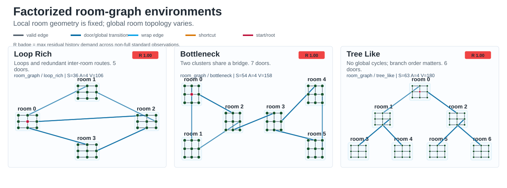
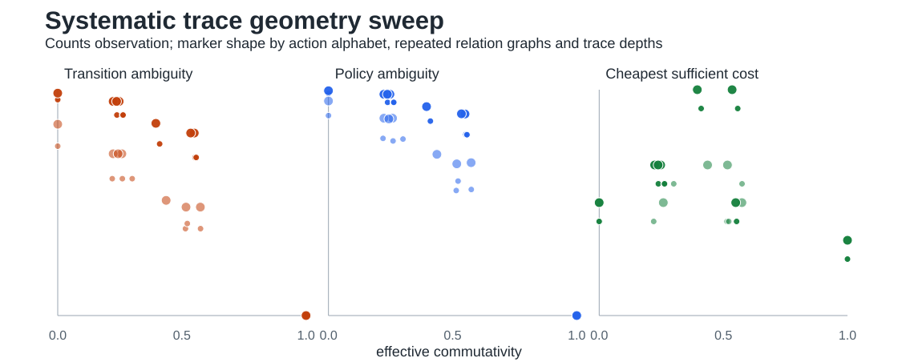
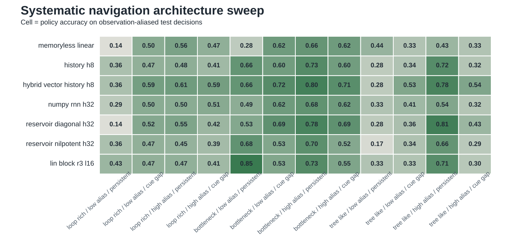
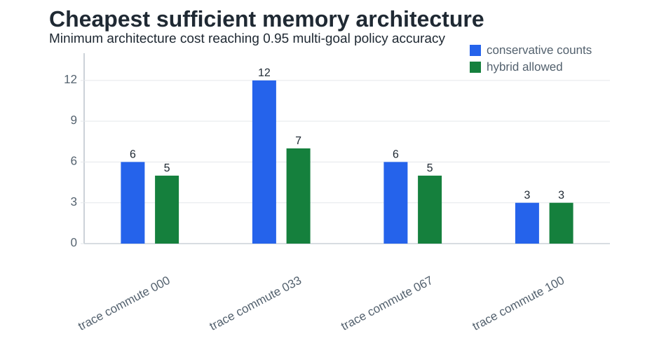

# Current Results Synthesis

Date: 2026-05-22

## Reading Path

This note is the evidence hub. Read it before the detailed iteration notes.

- Formal diagnostic trail: [[iteration_001_commutativity_probe]] -> [[iteration_005_policy_ambiguity]].
- Lightweight architecture trail: [[iteration_006_supervised_policy_benchmark]] -> [[iteration_008_architecture_selection_and_paper_completion]].
- Recurrent and Lin-facing trail: [[iteration_009_rnn_reservoir_navigation]] -> [[iteration_013_systematic_paper_sweeps]].
- Paper-facing manuscript: [[../manuscript/paper_draft|paper_draft]].

## Current Primary Figure Set

The environment galleries show the latent graphs before the diagnostics and architecture summaries.







The current paper-facing organization uses these three figures as the main sweep-level evidence.






## Current Scientific Status

The project has moved from a broad verbal theory to a lightweight empirical pipeline:

1. effective commutativity;
2. observation ambiguity;
3. transition ambiguity;
4. goal-conditioned policy ambiguity;
5. supervised policy benchmarks;
6. multi-goal lightweight robustness tests.

Together, these support the central claim that memory architecture should depend on how task geometry and input format determine history compressibility.

## Result 1: Boundary Effects Are Real But Separatable

The torus lattice is exactly commutative, while the clamped lattice is not fully commutative in raw mode.

```text
torus_lattice,1.000,1.000
clamped_lattice,0.786,1.000
```

Interpretation: locally metric environments can look noncommutative when finite boundaries are part of the task. This is not a problem; it means raw and valid-only commutativity answer different questions.

- raw commutativity: full finite task constraints;
- valid-only commutativity: local action algebra.

## Result 2: Shortcut Trees Are Not Enough

Shortcut trees did not produce a clean tree-to-lattice interpolation. They add lateral graph moves, but those moves do not generally commute with parent/child moves.

Interpretation: graph shortcuts are not the same as path equivalence. This justifies moving to trace-monoid environments.

## Result 3: Trace Environments Control History Compressibility

Valid-only commutativity increases as more action pairs commute.

```text
trace_commute_000,0.000
trace_commute_033,0.264
trace_commute_067,0.534
trace_commute_100,1.000
```

Interpretation: trace environments are the current best formal backbone. They directly manipulate the paper's core variable: whether action order matters.

Supporting diagnostic overview:


## Result 4: Count Observations Become Sufficient Only In Commutative Geometry

Count observations ignore action order. They are ambiguous when order matters and complete when all actions commute.

```text
environment         mean_candidates(counts)   retained_entropy(counts)
trace_commute_000   251.11                    0.447
trace_commute_033    93.94                    0.504
trace_commute_067    23.74                    0.619
trace_commute_100     1.00                    1.000
```

Interpretation: vector/count memory is not universally sufficient. Its sufficiency depends on task geometry.

## Result 5: Count Observations Are Non-Markov When Order Matters

The strongest pre-agent result is transition ambiguity:

```text
environment         mean_next_candidates(counts)   weighted_ambiguous_fraction(counts)
trace_commute_000   95.55                           0.993
trace_commute_033   41.17                           0.973
trace_commute_067   12.90                           0.873
trace_commute_100    1.00                           0.000
```

Interpretation: in noncommutative environments, count observations do not just lose information; they fail to define a Markov state. The same observation-action pair can lead to many different latent next states.


## Current Paper Claim Supported

The current results support this narrower claim:

> Coordinate-like memory is sufficient when task geometry makes action order irrelevant. When action order remains relevant, the same compressed observation can alias distinct latent states and distinct transition futures, creating a computational need for sequence memory.

## Result 6: Count Observations Can Be Insufficient For Policy Selection

Goal-conditioned policy ambiguity closes the pre-agent loop:

```text
environment         weighted_policy_ambiguity(counts)
trace_commute_000   0.997
trace_commute_033   0.987
trace_commute_067   0.920
trace_commute_100   0.000
```

Interpretation: when action order matters, count observations alias latent states that require different shortest-path actions. When all actions commute, counts are sufficient for optimal control.


## Result 7: Lightweight Multi-Goal Benchmark Supports The Same Trend

The new lightweight empirical benchmark evaluates nine goals per trace environment, degraded observation modes, finite memory lengths, and decision-tree classifiers.

Under the all-state lookup diagnostic, count/vector policy sufficiency increases with commutativity:

```text
environment         memoryless_counts   history_depth_last_h4   hybrid_h4
trace_commute_000   0.517               1.000                   1.000
trace_commute_033   0.573               0.998                   0.996
trace_commute_067   0.823               0.925                   1.000
trace_commute_100   1.000               0.920                   1.000
```

The decision-tree benchmark follows the same broad architecture ranking:

```text
environment         full_state   memoryless_counts   history_counts_h4   hybrid_h4
trace_commute_000   0.998        0.503               0.998               0.998
trace_commute_033   0.985        0.551               0.974               0.988
trace_commute_067   0.968        0.792               0.962               0.978
trace_commute_100   0.943        0.762               0.864               0.968
```

Interpretation: the central count/vector result is not tied to a single target sequence. Across multiple goals, count-only memory becomes sufficient as the action algebra becomes commutative, while finite history and hybrid representations rescue noncommutative regimes.

## Result 8: The Cheapest Sufficient Architecture Changes With Geometry

The architecture-selection analysis asks which representation reaches a target accuracy with the lowest memory cost. At the 0.95 threshold:

```text
environment         conservative_counts   cost   hybrid_allowed               cost
trace_commute_000   history_counts_h2      6      hybrid_counts_depth_last_h1  5
trace_commute_033   history_counts_h4     12      hybrid_counts_depth_last_h2  7
trace_commute_067   history_counts_h2      6      hybrid_counts_depth_last_h1  5
trace_commute_100   memoryless_counts      3      memoryless_counts            3
```

Interpretation: when all actions commute, vector/count memory is sufficient and cheapest. When action order matters, the selector shifts to finite-history or hybrid memory. This result is the strongest direct support for the paper's architecture claim.



## Result 9: A Repeated Formal Sweep Consolidates Geometry, Ambiguity, And Memory Cost

The new formal sweep repeats the trace analysis over action alphabets `K in {3,4}`, depths `4` and `6`, and multiple commutation relation graphs at intermediate relation density. This merges the prior ambiguity and architecture-selection diagnostics into one table.

Representative counts-observation results at depth `6`:

```text
condition                 effective_commute  transition_ambiguity  policy_ambiguity
K3 rho000                 0.000              0.956                 0.983
K3 rho100                 1.000              0.000                 0.000
K4 rho000                 0.000              0.985                 0.995
K4 rho100                 1.000              0.000                 0.000
```

The cheapest sufficient lookup memory also returns to memoryless counts only in the fully commutative condition. Intermediate and noncommutative relation graphs select hybrid count-plus-route-history variants at the `0.95` threshold.

Interpretation: the paper no longer needs separate trace examples for commutativity, transition ambiguity, policy ambiguity, and memory cost. They are linked outcomes of one geometry sweep.

## Result 10: A Factorized Room-Graph Sweep Tests Navigation Architectures

The room-graph sweep uses locally metric rooms with loop-rich, bottleneck, or tree-like global connectivity. It crosses topology with low/high aliasing and persistent/cue-gap observation regimes, then evaluates memoryless, explicit-history, hybrid, RNN, reservoir, and independent Lin-block readouts on held-out supervised policy labels.

Decision-level accuracy under high aliasing and cue gaps:

```text
topology       memoryless_linear   hybrid_vector_history_h8
loop_rich      0.474               0.593
bottleneck     0.616               0.709
tree_like      0.330               0.544
```

The same output table records all-action accuracy, decision fraction, state dimension, seeds, and representative recurrent controls. Earlier named tasks such as delayed T-mazes, landmark gaps, and shortcut-route choices remain useful behavioral examples, but the primary learned claim is now carried by this controlled topology-by-aliasing sweep.

Interpretation: geometry and observation sparsity jointly control whether current observation is enough for supervised navigation decisions. Hybrid state is useful in the mixed local-metric/global-route regime the paper is trying to explain.

## Result 11: Delay By Span Turns The Lin Bridge Into A Phase Boundary

The delay-span sweep varies sparse cue-gap delay `D` and explicit-history or independent Lin-block span `H/L`. A dense visible-state memoryless ceiling is `1.000` at all tested delays, so failures in the sparse cue-gap condition are memory-demand failures rather than unsolved action labels.

```text
cue-gap condition          D64      D80
memoryless linear          0.500    0.495
history H64                1.000    0.647
Lin block R3 L64           0.993    0.663
history H80                1.000    1.000
Lin block R3 L80           1.000    0.995
```

The sweep also keeps 32- and 128-unit NumPy RNN and nilpotent reservoir controls in the table. At `D=80`, the 128-unit nilpotent reservoir remains below the long finite-memory controls at `0.421`.

Interpretation: the Lin-facing result is now horizon matched. Sequence-span advantage appears when the memory span reaches the delayed cue horizon, rather than as an isolated long-T-maze comparison.

## What Is Still Missing

The remaining missing pieces are for a stronger future computational-neuroscience model paper, not for the current theory/diagnostic version:

- a full RL hippocampus-inspired sequence-generator agent;
- continuous egocentric visual input rather than lightweight egocentric-landmark features;
- perturbation-style comparisons of sequence memory vs path-integration memory;
- larger-scale training only after the lightweight benchmark is stable.

Do not claim learned hippocampal-agent superiority under RL yet. The defensible claim is currently about representational sufficiency, Markov state structure, shortest-path policy sufficiency, lightweight supervised performance, cost-aware architecture selection, and supervised recurrent-control evidence.

## Recommended Next Step

Use the three systematic sweeps as the paper's current empirical base and move the next empirical increment toward the Lin/Yiu/Leibold regime:

- keep the repeated trace sweep as the formal control;
- keep room-graph and delay-span sweeps as the primary learned figures;
- keep delayed and repeated-route behavioral tasks as supervised controls;
- replace symbolic egocentric proxies with continuous visual input in the next agent benchmark;
- add actor-critic training and the trained hippocampus-inspired sequence generator after the lightweight controls are stable.

This preserves the controlled geometry analysis while closing the remaining gap to the lab anchor.

## Report Provenance

- Formal controls and ambiguity metrics: [[iteration_001_commutativity_probe]], [[iteration_002_trace_monoid_environment]], [[iteration_003_observation_ambiguity]], [[iteration_004_transition_ambiguity]], [[iteration_005_policy_ambiguity]].
- Lightweight and cost-aware architecture results: [[iteration_006_supervised_policy_benchmark]], [[iteration_007_lightweight_empirical_benchmark]], [[iteration_008_architecture_selection_and_paper_completion]].
- Navigation and Lin-facing controls: [[iteration_009_rnn_reservoir_navigation]], [[iteration_010_supervised_lin_bridge]], [[iteration_011_long_lin_blocks]], [[iteration_012_long_architecture_comparison]], [[iteration_013_systematic_paper_sweeps]].
