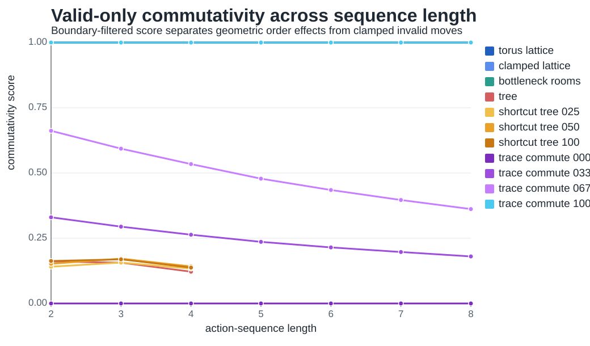
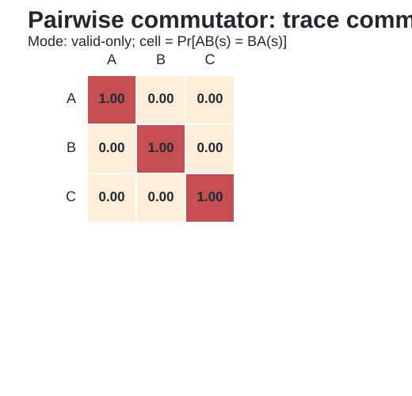
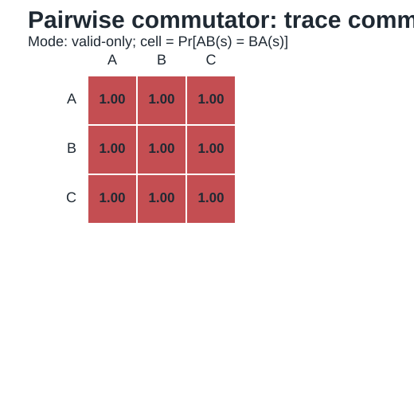

# Iteration 002: Trace-Monoid Environment

Date: 2026-05-20

## Question

Can we build an environment family where commutativity is manipulated directly, rather than approximated by spatial shortcuts?

## Implementation

Added a trace-monoid action-history environment to `../../geomem-experiments/experiments/commutativity_probe.py`.

States are canonical action histories. A relation table defines which action pairs commute. If a pair commutes, adjacent actions are sorted into a canonical order. This creates equivalence classes of histories:

- no commuting pairs: ordered histories remain distinct, like a sequence tree;
- all pairs commute: only action counts matter, like a coordinate/vector state;
- partial commutation: some history dimensions compress and others remain ordered.

The implemented family uses three actions:

- `trace_commute_000`: no action pairs commute;
- `trace_commute_033`: one of three action pairs commutes;
- `trace_commute_067`: two of three action pairs commute;
- `trace_commute_100`: all action pairs commute.

## Current Results

At action-sequence length 4:

```text
environment,raw_commutativity,valid_only_commutativity
trace_commute_000,0.790,0.000
trace_commute_033,0.771,0.264
trace_commute_067,0.716,0.534
trace_commute_100,0.722,1.000
```

The valid-only score gives the intended monotonic interpolation. The raw score is less interpretable because finite maximum depth creates boundary/self-loop effects. This confirms that for formal geometry, valid-only commutativity is the correct local algebra metric.



## Pairwise Diagnostic

The pairwise commutator matrices behave exactly as expected:

- `trace_commute_000`: different actions do not commute.
- `trace_commute_033`: only the selected action pair commutes.
- `trace_commute_067`: two selected pairs commute.
- `trace_commute_100`: all action pairs commute.

This is the cleanest formal evidence so far that action equivalence can be controlled independently of ordinary graph shortcuts.





## Interpretation

This environment is a better formal backbone for GeoMem than Dyck language or shortcut trees. It directly implements the paper's core variable: whether history can be compressed without loss.

The trace-monoid family also clarifies the memory prediction:

- no commutation requires preserving ordered action history;
- full commutation permits compression to action counts;
- partial commutation requires a hybrid representation.

## Consequence For The Paper

The main formal model should be the trace/partial-commutation environment. Dyck remains a limiting case for stack memory. Shortcut trees remain a useful cautionary diagnostic: graph shortcuts are not the same as path equivalence.

## Next Missing Part

The current metric only measures geometry. The next paper-critical missing piece is task/input structure:

- add sparse and dense observations;
- add sensory aliasing by mapping multiple latent states to the same observation;
- define a simple memory demand proxy before training agents.

The next iteration should implement an observation model and estimate state ambiguity under sparse observations.

Continue with [[iteration_003_observation_ambiguity]].
