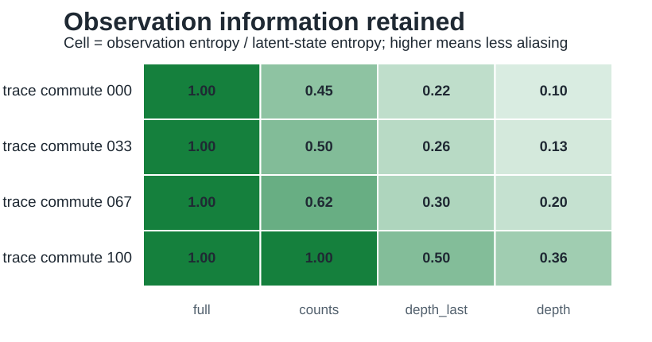
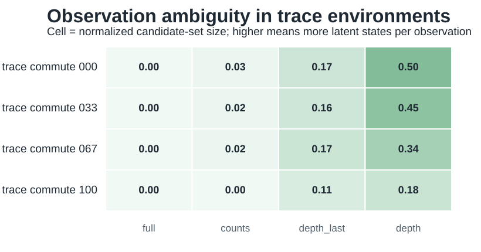

# Iteration 003: Observation Ambiguity

Date: 2026-05-20

## Question

Can we operationalize the second axis of the hypothesis, input density, before training agents?

## Implementation

Added `../../geomem-experiments/experiments/observation_ambiguity.py`.

The script evaluates trace-monoid environments under four observation modes:

- `full`: full canonical latent state;
- `counts`: action counts only;
- `depth_last`: sequence depth and last action;
- `depth`: sequence depth only.

For each mode, it reports the number of observations, mean latent candidates per observation, maximum candidates, normalized ambiguity, and retained entropy fraction.

## Key Results

The `counts` observation is the most theoretically important because it is the coordinate/vector-like summary. It becomes sufficient only when the task geometry is fully commutative.

```text
environment         mean_candidates(counts)   retained_entropy(counts)
trace_commute_000   251.11                    0.447
trace_commute_033    93.94                    0.504
trace_commute_067    23.74                    0.619
trace_commute_100     1.00                    1.000
```

This is exactly the desired interaction between geometry and input format. Count/vector observations are lossy in noncommutative environments, but sufficient in fully commuting environments.



The ambiguity view is useful for inspecting candidate-set collapse, but the retained-information figure is the cleaner cross-environment comparison because latent state-space size changes with commutativity.



## Interpretation

This diagnostic supports the central GeoMem claim more directly than the raw graph probes:

- In noncommutative geometry, the same action counts correspond to many ordered histories.
- In partially commutative geometry, count observations become less ambiguous but still lose some information.
- In fully commutative geometry, counts are a complete state representation.

This gives a pre-agent measure of memory demand. If an agent receives only count-like or sparse observations, sequence memory should be useful exactly when those observations alias many latent states.

## Important Caveat

Normalized ambiguity is not always the clearest metric because the total latent state space shrinks as commutativity increases. Retained entropy fraction and mean candidate-set size are more interpretable for comparing observation modes across trace environments.

## Consequence For The Paper

The hypothesis can now be stated more operationally:

> Sequence memory is useful when the observation function collapses distinct latent histories that remain behaviorally relevant. Vector/count memory is sufficient when the task geometry makes those histories equivalent.

## Next Missing Part

The next iteration should add a simple task objective on top of the trace environments:

- choose a goal latent state or goal equivalence class;
- compare whether observations alone identify the optimal action;
- compute a policy ambiguity or action ambiguity score before training neural agents.

This would connect state ambiguity to behavior, which is necessary before claiming memory architecture differences.

Continue with [[iteration_004_transition_ambiguity]].
