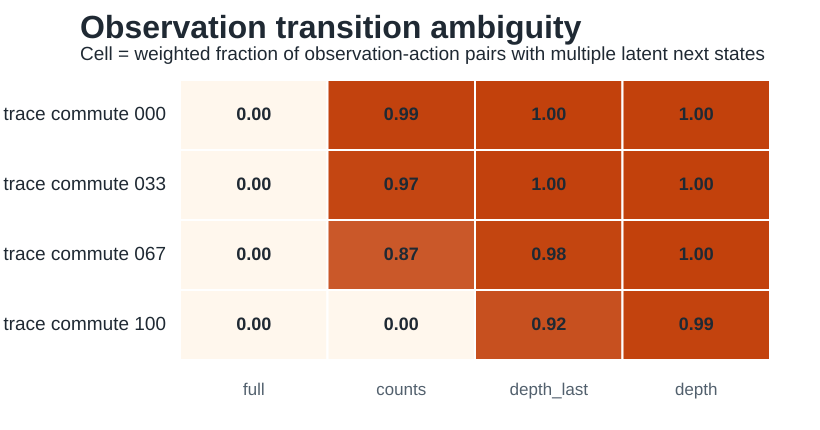

# Iteration 004: Transition Ambiguity

Date: 2026-05-20

## Question

Does observation aliasing create a non-Markov state representation, such that memory is needed to predict transitions?

## Implementation

Added `../../geomem-experiments/experiments/transition_ambiguity.py`.

For each trace environment and observation mode, the script groups latent states by observation. For each observation-action pair, it measures how many latent next states are possible. If the same observation and same action can lead to multiple latent next states, then the observation is not a Markov state.

## Key Results

The count observation again gives the cleanest test. Count observations are non-Markov when action order matters, but Markov when all actions commute.

```text
environment         mean_next_candidates(counts)   weighted_ambiguous_fraction(counts)
trace_commute_000   95.55                           0.993
trace_commute_033   41.17                           0.973
trace_commute_067   12.90                           0.873
trace_commute_100    1.00                           0.000
```

Full observations have no transition ambiguity in all environments. Depth and depth-last observations remain highly ambiguous even in the fully commutative environment because they discard count information.



## Interpretation

This moves the project from state ambiguity to computational relevance. In noncommutative environments, count-like observations collapse many histories that have different future transitions. A memoryless vector/count representation is therefore insufficient. In the fully commutative environment, counts are a complete Markov state.

This directly supports the core hypothesis:

> Vector/count memory is sufficient when task geometry makes order irrelevant; sequence memory is needed when the same compressed observation hides distinct transition futures.

## Consequence For The Paper

The paper can now define a pre-agent memory-demand metric:

- observation ambiguity: how many latent states share an observation;
- transition ambiguity: whether those aliased states have different futures under the same action.

Transition ambiguity is the stronger metric because it indicates that the observation is not Markov.

## Next Missing Part

The next step is reward or policy ambiguity:

- define goals over latent trace states or equivalence classes;
- compute whether aliased states require different optimal actions;
- use this to predict when memory architecture affects control performance.

Continue with [[iteration_005_policy_ambiguity]].
