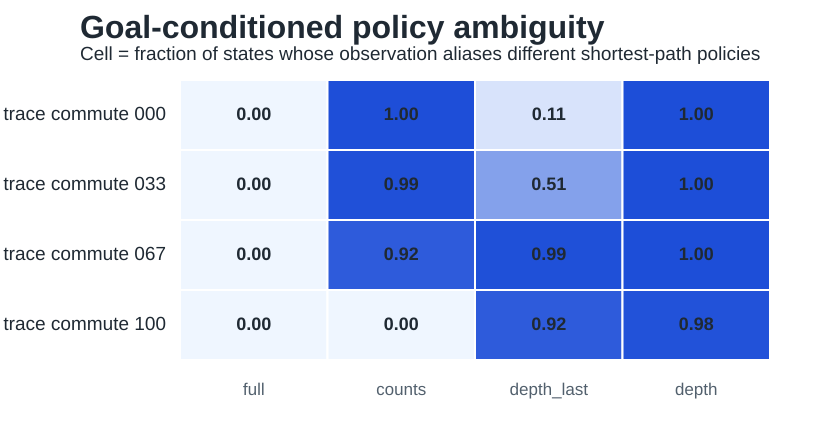

# Iteration 005: Goal-Conditioned Policy Ambiguity

Date: 2026-05-20

## Question

Do aliased observations require different optimal actions under a concrete goal-conditioned task?

## Implementation

Added `../../geomem-experiments/experiments/policy_ambiguity.py`.

The script treats each trace environment as a reversible navigation graph. A fixed goal trace state is chosen from the target action sequence `ABCABCAB`. For every latent state, the script computes shortest-path optimal actions to the goal. It then groups states by observation mode and asks whether states sharing the same observation require different optimal action sets.

This measures whether an observation is sufficient for control, not just for transition prediction.

## Key Results

Under count observations:

```text
environment         weighted_policy_ambiguity(counts)
trace_commute_000   0.997
trace_commute_033   0.987
trace_commute_067   0.920
trace_commute_100   0.000
```

Full observations have zero policy ambiguity in all environments. Count observations become sufficient only in the fully commuting environment.



## Interpretation

This is the strongest result so far. It closes the gap between representational ambiguity and control. In noncommutative environments, count/vector observations collapse latent states that require different shortest-path actions. In the fully commutative environment, the same count representation is sufficient for optimal goal-directed control.

This directly supports the paper's central claim:

> Whether vector/count memory is adequate depends on task geometry. When action order matters, compressed coordinate-like observations can be insufficient for policy selection, creating a computational role for sequence memory.

## Caveats

The policy task is still abstract. It uses a reversible trace graph and shortest-path actions, not a trained agent. This is appropriate for a pre-agent diagnostic, but the next step should train memory architectures on the same family.

## Decision

Use policy ambiguity as the strongest pre-agent criterion for memory demand. The agent-training experiments should be predicted by this metric.

## Next Missing Part

Implement a minimal supervised or reinforcement-learning benchmark:

- observation mode: full, counts, depth-last, depth;
- geometry: trace commutativity level;
- target: shortest-path action to a goal;
- model classes: memoryless MLP, RNN/sequence model, hybrid model.

Prediction: memoryless count-based models succeed in `trace_commute_100` but fail in noncommutative trace environments unless given full observations.

Continue with [[iteration_006_supervised_policy_benchmark]].
