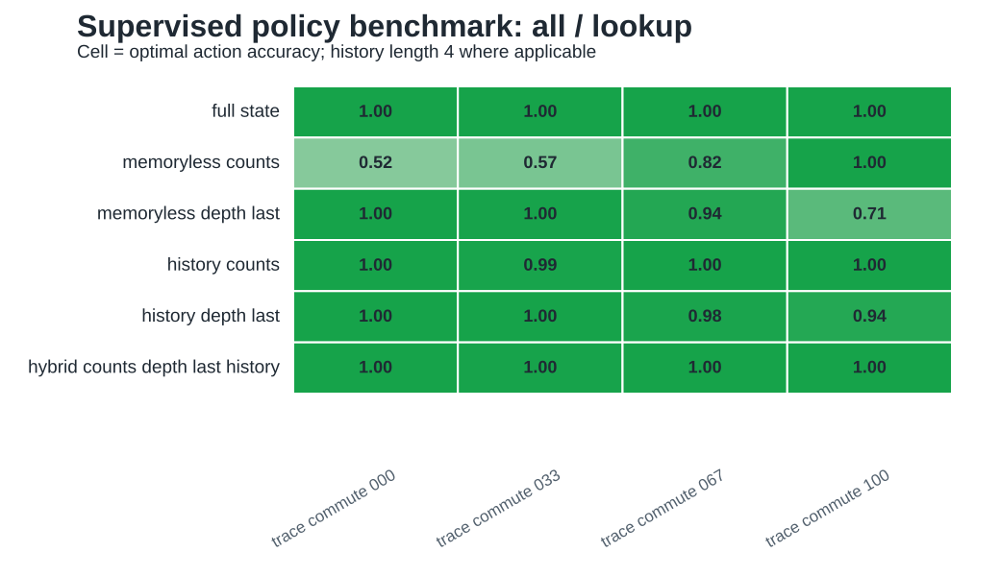
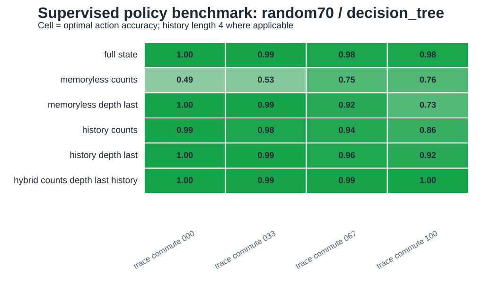

# Iteration 006: Supervised Policy Benchmark

Date: 2026-05-20

## Question

Do the pre-agent ambiguity diagnostics predict architecture-dependent policy learning?

## Implementation

Added `../../geomem-experiments/experiments/supervised_policy_benchmark.py`.

The benchmark uses shortest-path policy labels from the goal-conditioned trace task. It compares observation keys that mimic different memory architectures:

- `full_state`: full latent state upper bound;
- `memoryless_counts`: coordinate/vector-like state;
- `memoryless_depth_last`: sparse local observation;
- `history_counts`: finite observation-history memory;
- `history_depth_last`: finite local-observation-history memory;
- `hybrid_counts_depth_last_history`: current count/vector state plus finite recurrent-style history.

Two estimator types are reported:

- `lookup`: table-majority classifier; the `all` split is a sufficiency/Bayes-style diagnostic.
- `decision_tree`: supervised train/test classifier; the `random70` split is the main learned-control diagnostic.

## Key Results

The `all/lookup` condition matches the policy-ambiguity prediction:

```text
environment         memoryless_counts   history_counts   hybrid
trace_commute_000   0.517               1.000            1.000
trace_commute_033   0.571               0.990            0.996
trace_commute_067   0.822               1.000            1.000
trace_commute_100   1.000               1.000            1.000
```

The `random70/decision_tree` condition shows the same qualitative architecture ranking under learned train/test evaluation:

```text
environment         memoryless_counts   history_counts   hybrid
trace_commute_000   0.491               0.993            0.997
trace_commute_033   0.527               0.975            0.986
trace_commute_067   0.753               0.944            0.987
trace_commute_100   0.755               0.857            1.000
```

Values are optimal-action accuracy.

The lookup figure is the policy-sufficiency view. The decision-tree figure is the finite-data learning view.





## Interpretation

The cleanest result is the sufficiency diagnostic: count/vector memory is sufficient only when the trace geometry is fully commutative. Finite history or hybrid memory recovers high performance in noncommutative environments.

The learned decision-tree result supports the same direction, but it should be interpreted more cautiously. It includes data coverage and function-generalization effects in addition to representational sufficiency. In the fully commutative environment, `memoryless_counts` is theoretically sufficient, but the decision tree does not always infer the complete policy from a random 70% state sample. The `all/lookup` result is therefore the stronger test of sufficiency; the decision-tree result is a first learning sanity check.

## Consequence For The Paper

The paper can now distinguish three levels:

1. representational sufficiency: whether an observation identifies latent state;
2. policy sufficiency: whether an observation identifies optimal action;
3. learned performance: whether a model class learns the policy from finite data.

This prevents overclaiming while still giving the paper a model-comparison result.

## Next Missing Part

The next paper-critical step is to turn the manuscript from a project log into a structured paper:

- move diagnostics into a Methods section;
- convert numeric blocks into Results subsections with figure references;
- add figure captions;
- state the learned benchmark as a preliminary model comparison, not yet the final biological agent model.

Continue with [[iteration_007_lightweight_empirical_benchmark]].
