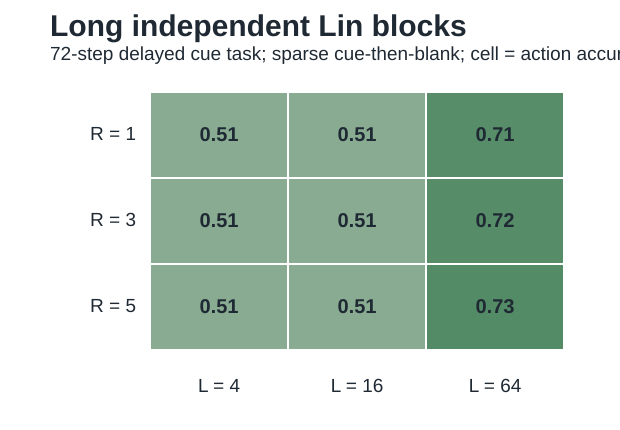

# Iteration 011: Long Independent Lin Blocks

Date: 2026-05-21

## Question

Does the supervised Lin bridge preserve the long, independent-sequence regime relevant to Lin/Yiu/Leibold 2026?

## Difference From Iteration 010

Iteration 010 added a short `R x L` sequence grid with `L <= 8`. That is useful for small behavioral controls, but it is not faithful to the long-horizon regime. The long bridge now adds:

- `L in {4, 16, 64}`;
- a 72-step sparse delayed-cue task;
- independent block-nilpotent chains, one finite chain per input feature;
- balanced long delayed-turn labels so whole-policy accuracy cannot be dominated by forward actions.

## Outputs

- `../../geomem-experiments/figures/rnn_lin_long_sequence_benchmark.csv`;
- `../../geomem-experiments/figures/rnn_lin_long_sequence_summary.csv`;
- `../../geomem-experiments/figures/rnn_lin_long_sequence_grid.svg`.



## Key Result

Sparse cue-then-blank action accuracy on the long delayed-cue task:

```text
model / block              accuracy
memoryless linear          0.506
NumPy RNN                  0.506
R1 L4, ell 4               0.506
R1 L16, ell 16             0.506
R1 L64, ell 64             0.694
R3 L64, ell 66             0.714
R5 L64, ell 68             0.729
```

The context readout also separates long from short block chains. For sparse cue-then-blank `R=3`, context decoding rises from `0.506` at `L=4` and `0.565` at `L=16` to `0.702` at `L=64`.

## Interpretation

The long bridge addresses three trivial mismatches in the earlier supervised proxy:

1. the horizon was too short;
2. the environment delay did not require long sequences;
3. the sequence state was a mixed short buffer rather than independent finite chains.

This still is not the Lin actor-critic visual agent. It is a controlled supervised condition showing that a long independent sequence span becomes necessary once the delayed behavioral example is long enough.

The matched architecture comparison follows in [[iteration_012_long_architecture_comparison]].
