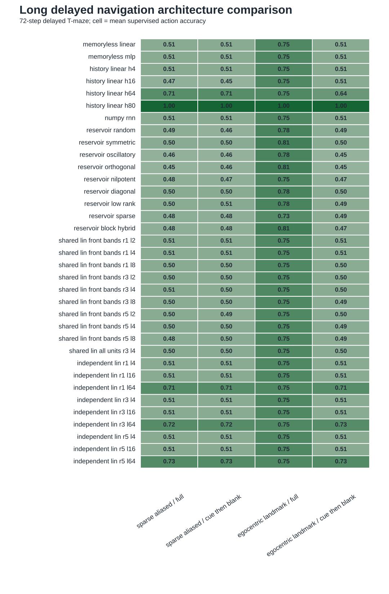

# Iteration 012: Long Architecture Comparison

Date: 2026-05-21

## Question

Do the long independent Lin blocks still matter when the corrected long delayed task includes the previous architecture families on the same splits?

## Comparison Added

The long delayed T-maze now compares:

- memoryless linear and MLP controls;
- explicit observed-history linear readouts with windows `H in {4,16,64,80}`;
- the 32-unit trained NumPy RNN;
- every fixed 32-unit reservoir family already used by the benchmark;
- the previous shared Lin buffers with `L <= 8`;
- independent block-nilpotent Lin chains with `L in {4,16,64}` and `R in {1,3,5}`.

The detailed rows are in `../../geomem-experiments/figures/rnn_lin_long_sequence_summary.csv`. The family-level winner table is in `../../geomem-experiments/figures/rnn_lin_long_architecture_families.csv`, and `../../geomem-experiments/figures/rnn_lin_long_architecture_comparison.svg` visualizes all long-task models.



## Sparse Cue-Then-Blank Result

```text
architecture/control              action accuracy
memoryless linear                 0.506
memoryless MLP                    0.506
NumPy RNN                         0.506
best 32-unit fixed reservoir      0.505
best prior shared Lin buffer      0.506
explicit history H4               0.506
explicit history H16              0.506
explicit history H64              0.690
independent Lin R1 L64            0.694
independent Lin R3 L64            0.714
independent Lin R5 L64            0.729
explicit history H80              1.000
```

The egocentric-landmark cue-then-blank condition has the same ranking: `H64` reaches `0.690`, independent `L=64` blocks reach `0.698` to `0.733`, and `H80` reaches `1.000`.

## Interpretation

The old short-horizon controls do not solve the long delayed condition. The independent block advantage is aligned with finite memory horizon: short explicit history and short block chains fail together; `H64` and `L=64` become useful together; a history window that covers the cue is a near-trivial ceiling.

This makes the supervised claim more precise. The current result supports long independent sequence state as an efficient structured delayed-information carrier in this benchmark. It does not yet prove superiority over a capacity- and horizon-matched trained recurrent agent under RL.

The paper-level consolidation follows in [[iteration_013_systematic_paper_sweeps]].
