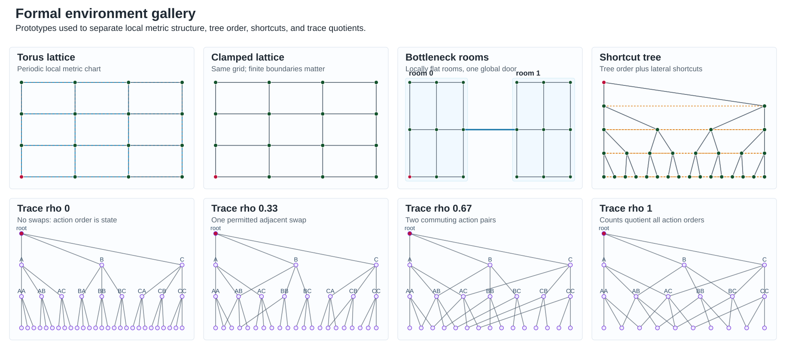
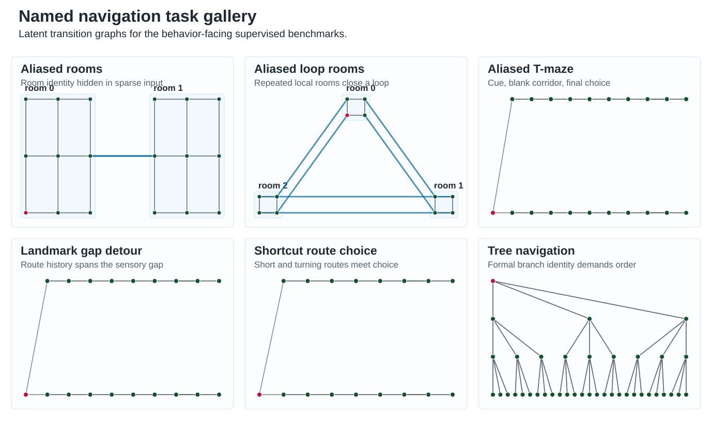
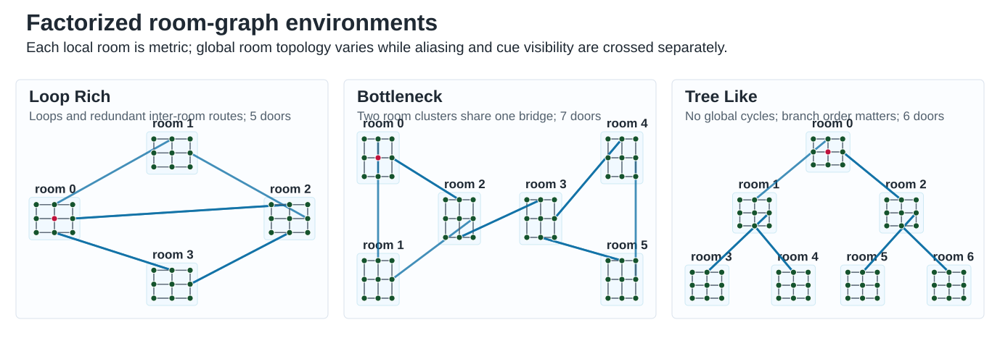
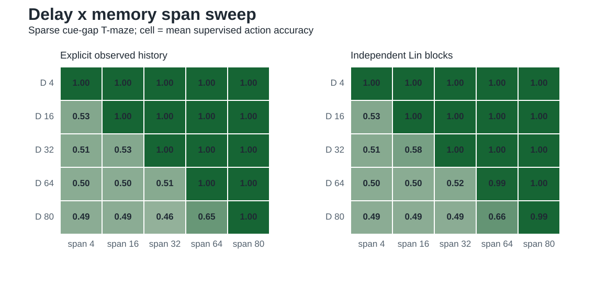

---
tags:
  - geomem
  - report-index
status: working
updated: 2026-05-22
---

# GeoMem Reports

This folder is the evaluation-work trail for GeoMem. Start with [[current_results_synthesis]] for the current scientific position, then open the iteration notes when a result or decision needs its provenance.

## Current Hubs

- [[current_results_synthesis]]: current evidence, claims, limits, and next step.
- [[paper_missing_parts]]: paper-completion checklist.
- [[reviewer_opinion]]: reviewer-style evaluation and claim calibration.
- [[../manuscript/paper_draft|paper draft]]: current paper-facing manuscript.
- [[../theory/lin_block_advantage|Lin-block theory note]]: calibrated mechanism-level explanation for independent Lin blocks versus generic reservoirs.

## Formal Diagnostics

- [[iteration_001_commutativity_probe]]: boundary effects and corrected commutativity probe.
- [[iteration_002_trace_monoid_environment]]: trace-monoid formal backbone.
- [[iteration_003_observation_ambiguity]]: observation aliasing under geometry.
- [[iteration_004_transition_ambiguity]]: non-Markov compressed observations.
- [[iteration_005_policy_ambiguity]]: goal-conditioned policy ambiguity.

## Benchmarks And Architecture Selection

- [[iteration_006_supervised_policy_benchmark]]: supervised trace policy benchmark.
- [[iteration_007_lightweight_empirical_benchmark]]: multi-goal robustness and finite-memory tests.
- [[iteration_008_architecture_selection_and_paper_completion]]: cost-aware architecture selection and paper restructuring.

## Navigation And Lin-Facing Controls

- [[iteration_009_rnn_reservoir_navigation]]: recurrent/reservoir supervised navigation benchmark.
- [[iteration_010_supervised_lin_bridge]]: short-horizon Lin-style sequence bridge.
- [[iteration_011_long_lin_blocks]]: long independent Lin blocks.
- [[iteration_012_long_architecture_comparison]]: matched long-delay architecture comparison.
- [[iteration_013_systematic_paper_sweeps]]: current formal, room-graph, and delay-span sweep organization.
- [[iteration_014_temporal_basis_benchmark]]: nilpotent versus oscillatory temporal-basis control.

## Figure Entry Points

