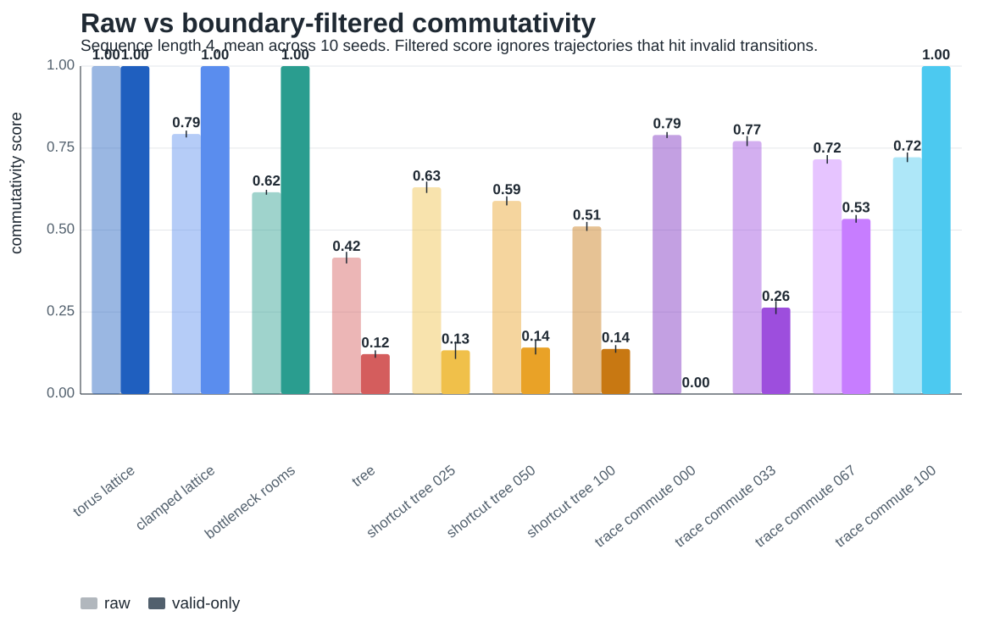
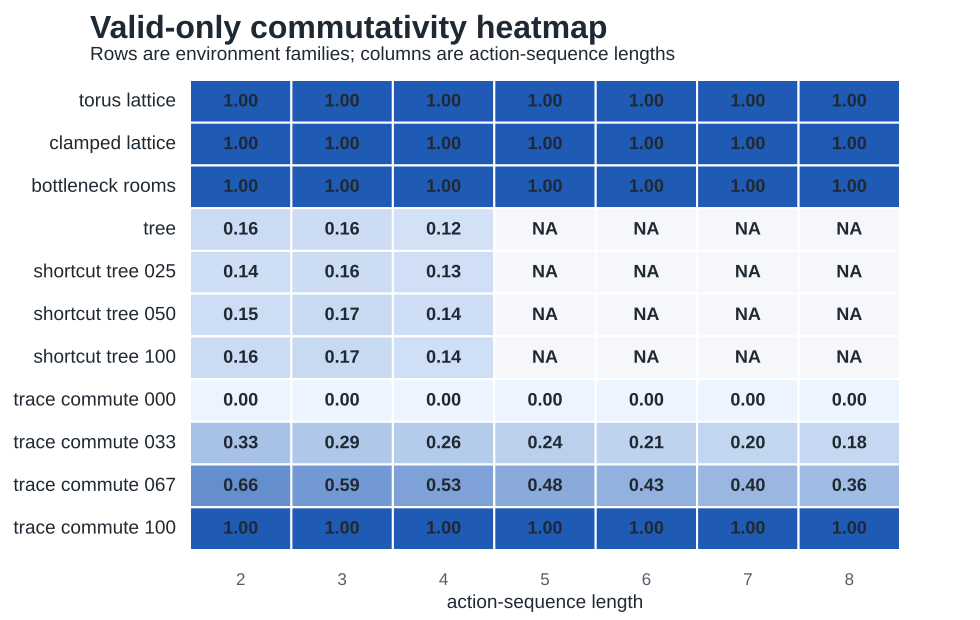
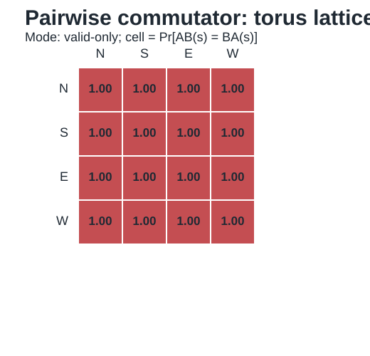
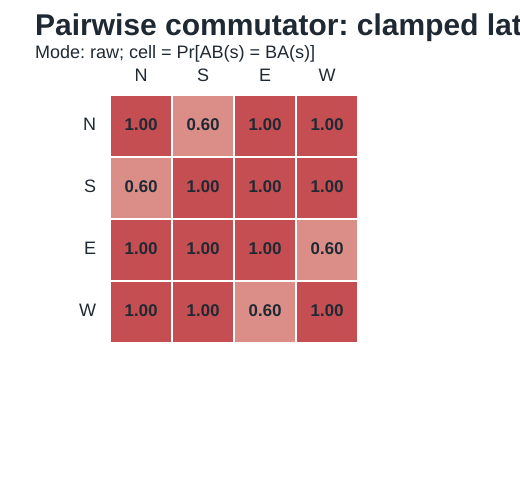

# Iteration 001: Corrected Commutativity Probe

Date: 2026-05-20

## Question

Does the current effective-commutativity probe cleanly separate locally metric environments from tree-like environments?

## Evaluation

The first probe gave the right qualitative order but mixed theoretical commutativity with boundary artifacts. The bounded lattice was not fully commutative because clamped boundaries make inverse action orders differ. Tree and shortcut-tree comparisons were also confounded because the first versions used different branching factors and action sets.

The corrected probe now separates:

- raw commutativity: the full finite task dynamics, including boundaries and invalid moves;
- valid-only commutativity: local action algebra after filtering trajectories that hit invalid transitions.

## Current Results





```text
environment,raw_commutativity,valid_only_commutativity
torus_lattice,1.000,1.000
clamped_lattice,0.786,1.000
bottleneck_rooms,0.632,1.000
tree,0.458,0.330
shortcut_tree_025,0.669,0.394
shortcut_tree_050,0.617,0.366
shortcut_tree_100,0.543,0.353
```

## Interpretation

The torus lattice is the correct positive control: it is exactly commutative in both raw and valid-only modes. The clamped lattice is below one in raw mode because boundary clamping creates order effects, but it returns to one under valid-only filtering. This confirms that the earlier lattice result was not a failure of the theory; it was a finite-boundary effect.

Bottleneck rooms behave like locally Euclidean patches under valid-only filtering. Their raw noncommutativity comes from walls, doors, and boundary constraints, not from local action algebra. This is useful for the paper because it separates local metric structure from global task constraints.

The tree remains low under valid-only filtering, which supports the intended contrast. In a tree, child actions and the parent action do not commute. Different histories usually remain distinct.

The pairwise matrices make the boundary/control distinction visible. The torus control is uniformly commuting, while the bounded lattice exposes the inverse-action boundary effect.





Shortcut trees are the main surprise. Lateral same-depth shortcuts raise raw scores because they introduce more self-loop or boundary-like effects, but they do not create a clean monotonic rise in valid-only commutativity. The reason is conceptual: adding lateral actions is not the same as imposing path equivalences. The new lateral actions still fail to commute with up/down/child actions.

## Consequence For The Paper

The paper should not claim that shortcut trees by themselves interpolate from tree-like to lattice-like geometry. The stronger claim should be:

> Lateral shortcuts diagnose graph-level route structure, but true interpolation from sequence memory to coordinate memory requires explicit path equivalence or partial commutation.

This supports the choice of partial commutation or trace-monoid environments as the cleaner formal model.

## Missing Part Identified

The project needs a second environment family where shortcut density genuinely changes action equivalence. A good next step is a quotient or trace-monoid environment:

- start with action strings as states;
- impose selected commutation relations such as `AB = BA`;
- increase the number of commuting action pairs;
- measure whether memory demand shifts from ordered history to count/vector state.

This would directly test the theory variable instead of relying on spatial shortcuts to approximate it.

## Decision

Keep the current corrected probe as a diagnostic figure set. Add a new quotient/trace environment as the next implementation target. In the manuscript, describe shortcut trees as a failed or incomplete interpolation that clarified the need for explicit path equivalence.

## Files

- `experiments/commutativity_probe.py`
- `experiments/plot_current_results.py`
- `figures/current_commutativity_results.csv`
- `figures/pairwise_commutator_matrices.csv`
- `figures/commutativity_bar.svg`
- `figures/commutativity_by_length.svg`
- `figures/commutativity_heatmap.svg`
- `figures/commutator_matrix_*_raw.svg`
- `figures/commutator_matrix_*_valid.svg`

## Continue

The formal fix is evaluated in [[iteration_002_trace_monoid_environment]].
