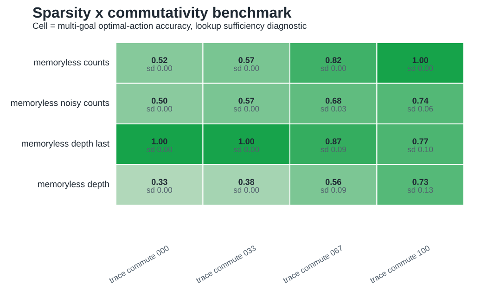
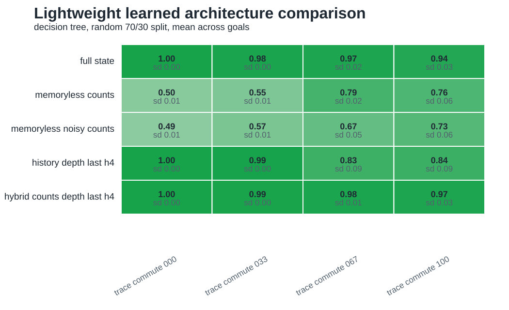
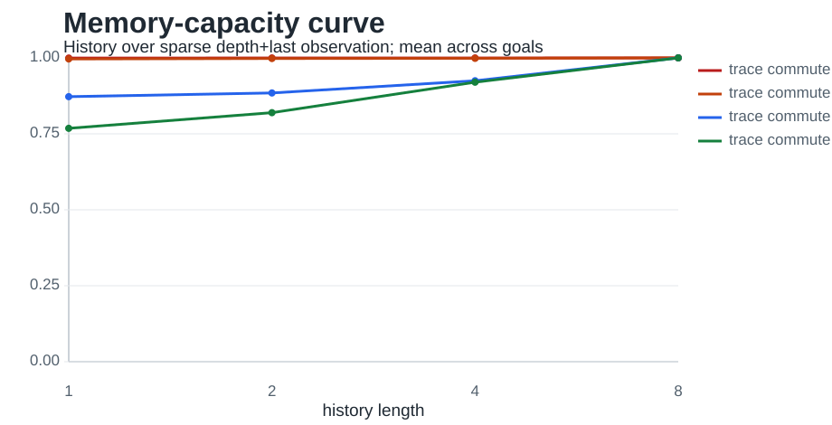

# Iteration 007: Lightweight Empirical Benchmark

Date: 2026-05-20

## Question

Do the current trace-task conclusions survive lightweight empirical tests over multiple goals, degraded observations, finite memory capacity, and simple learned classifiers?

## Implementation

Added `experiments/lightweight_empirical_benchmark.py`.

The benchmark keeps the experiment small and deterministic. It uses the existing trace-monoid environments and shortest-path policy labels, then evaluates:

- four commutativity levels: `trace_commute_000`, `trace_commute_033`, `trace_commute_067`, `trace_commute_100`;
- nine goals per environment: the fixed `ABCABCAB` goal plus eight deterministic sampled goals at depths 5-8;
- observation modes: `counts`, `noisy_counts`, `depth_last`, and `depth`;
- finite history lengths: 1, 2, 4, and 8;
- architecture keys: memoryless, history, hybrid count-plus-local-history, and full-state upper bound;
- estimators: all-state lookup for policy sufficiency and random 70/30 decision tree for lightweight learned performance.

The script generated:

- `figures/lightweight_empirical_benchmark.csv`;
- `figures/lightweight_sparsity_commutativity.svg`;
- `figures/lightweight_multigoal_robustness.svg`;
- `figures/lightweight_architecture_comparison.svg`;
- `figures/lightweight_memory_capacity.svg`.

## Figure Overview





## Key Results

The multi-goal lookup result preserves the main count/vector prediction:

```text
environment         memoryless_counts   history_depth_last_h4   hybrid_h4
trace_commute_000   0.517               1.000                   1.000
trace_commute_033   0.573               0.998                   0.996
trace_commute_067   0.823               0.925                   1.000
trace_commute_100   1.000               0.920                   1.000
```

Count/vector policy sufficiency increases with commutativity and reaches ceiling only in the fully commuting environment. Hybrid memory remains at or near ceiling across the full range.

The sparse/degraded observation comparison shows that input format matters:

```text
environment         counts   noisy_counts   depth_last   depth
trace_commute_000   0.517    0.500          0.999        0.333
trace_commute_033   0.573    0.568          0.997        0.382
trace_commute_067   0.823    0.683          0.872        0.559
trace_commute_100   1.000    0.738          0.768        0.728
```

The learned decision-tree benchmark follows the same broad architecture ranking:

```text
environment         full_state   memoryless_counts   history_counts_h4   history_depth_last_h4   hybrid_h4
trace_commute_000   0.998        0.503               0.998               0.998                   0.998
trace_commute_033   0.985        0.551               0.974               0.994                   0.988
trace_commute_067   0.968        0.792               0.962               0.833                   0.978
trace_commute_100   0.943        0.762               0.864               0.839                   0.968
```

The memory-capacity curve shows that finite history can rescue policy sufficiency:

```text
environment         h1      h2      h4      h8
trace_commute_000   0.517   1.000   1.000   1.000   history_counts
trace_commute_033   0.573   0.942   0.991   1.000   history_counts
trace_commute_067   0.823   0.997   0.999   1.000   history_counts
trace_commute_100   1.000   1.000   1.000   1.000   history_counts
```



## Interpretation

This iteration strengthens the paper's empirical base without large-scale training. The central count/vector claim is now multi-goal rather than tied to `ABCABCAB`: count-only policy sufficiency increases monotonically with commutativity, while hybrid memory stays robust.

The benchmark also exposes a useful caveat. `depth_last` is very strong in low-commutativity trace tasks because shortest-path control often reduces to reversing the last action until the route intersects the goal. This is not a contradiction of the theory; it shows that the current trace shortest-path task can make a sparse local cue more informative than intended. The manuscript should not treat `depth_last` as a generic sparse sensory baseline. It is better interpreted as a route-reversal cue.

The decision-tree results are supportive but still not a neural-agent result. They show that the architecture ranking survives a finite-data supervised classifier, but they do not replace recurrent or hippocampus-inspired training.

## Consequence For The Paper

The paper can now claim:

> Across multiple goals in a controlled trace-navigation family, coordinate/count memory becomes policy-sufficient as action commutativity increases, while finite history and hybrid memories rescue performance when order remains behaviorally relevant.

The paper should still avoid claiming:

> Hippocampal sequence generators have been shown to outperform path integration in learned navigation agents.

That requires the later large-scale recurrent or sequence-generator training stage.

The cost-aware next step is evaluated in [[iteration_008_architecture_selection_and_paper_completion]].
