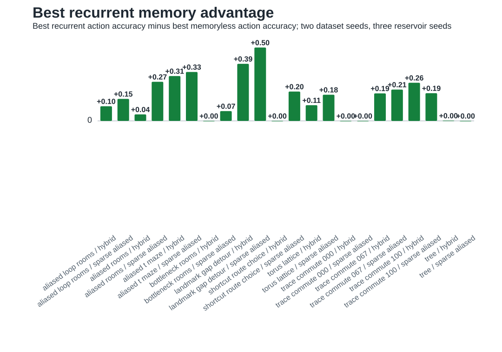
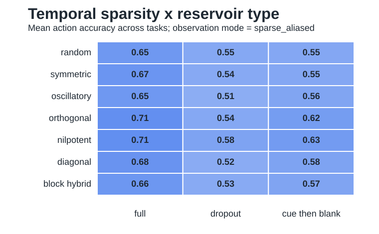
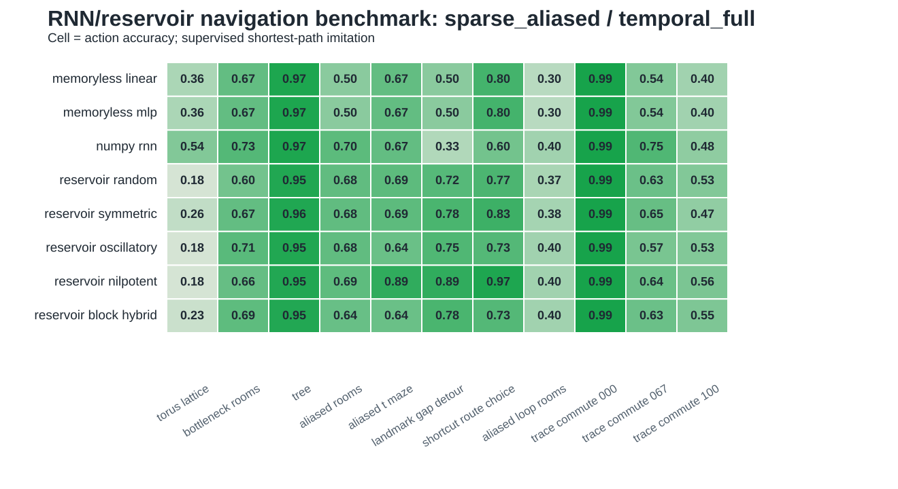

# Iteration 009: RNN And Reservoir Navigation Benchmark

Date: 2026-05-21

Note: this report records the pre-Lin-bridge reservoir iteration. The generated `rnn_*` figures and CSVs were expanded in `iteration_010_supervised_lin_bridge.md` with behavioral tasks, egocentric-landmark input, and explicit `R/L/ell` sequence readouts.

## Question

Do learned recurrent models and fixed reservoir dynamics improve goal-conditioned navigation when observations are sparse, aliased, or noncommutative?

## Implementation

Added:

- `experiments/rnn_navigation_benchmark.py`;
- `experiments/recurrent_matrix_analysis.py`;
- `figures/rnn_navigation_benchmark.csv`;
- `figures/rnn_navigation_summary.csv`;
- `figures/rnn_memory_advantage.csv`;
- `figures/rnn_temporal_sparsity_summary.csv`;
- `figures/rnn_temporal_sparsity_advantage.csv`;
- `figures/rnn_weight_analysis.csv`;
- `figures/reservoir_matrix_analysis.csv`;
- `figures/rnn_navigation_*_accuracy.svg`;
- `figures/rnn_navigation_*_success.svg`;
- `figures/rnn_memory_advantage.svg`;
- `figures/rnn_temporal_sparsity_reservoirs.svg`;
- `figures/reservoir_matrix_analysis.svg`.

The benchmark converts existing generated geometries into goal-conditioned imitation-learning tasks. Each example consists of an observation history to the current state, a goal observation, and a shortest-path optimal action label. This is supervised control, not RL.

The task set includes metric, graph-like, aliased, and trace geometries:

- `torus_lattice`;
- `bottleneck_rooms`;
- `tree`;
- `aliased_rooms`;
- `aliased_loop_rooms`;
- `aliased_t_maze`;
- `trace_commute_000`;
- `trace_commute_067`;
- `trace_commute_100`.

The new `aliased_rooms` task is a small navigation-like POMDP: two identical rooms share local observations, and a bottleneck links them. Latent room identity is hidden under sparse observations.

The benchmark now uses two dataset seeds and three reservoir seeds. It separates unit/identity sparsity from temporal sparsity using three temporal modes: full input, random temporal dropout, and cue-then-blank histories. The `aliased_t_maze` task is a small diagnostic rather than decisive evidence; the stronger navigation evidence comes from `aliased_rooms`, `aliased_loop_rooms`, `bottleneck_rooms`, and the trace tasks.

## Models

- `memoryless_linear`: linear classifier from current observation plus goal.
- `memoryless_mlp`: one-hidden-layer MLP from current observation plus goal.
- `numpy_rnn`: trainable tanh RNN with manual NumPy backpropagation through time.
- fixed reservoirs with trained linear readout:
  - random;
  - symmetric;
  - oscillatory;
  - orthogonal;
  - nilpotent;
  - diagonal;
  - low-rank;
  - sparse;
  - block-hybrid.

PyTorch was not used because the local `torch` package is only a namespace stub and does not expose `torch.nn`.

## Key Results

Mean action accuracy across tasks:

```text
observation       memoryless_linear  memoryless_mlp  numpy_rnn  best fixed-reservoir family
vector            0.660              0.557           0.683      diagonal, 0.703
sparse_aliased    0.641              0.552           0.736      diagonal, 0.678
hybrid            0.700              0.591           0.758      diagonal, 0.703
```

The sparse/aliased condition is the most important test for the manuscript claim. There, the trained RNN improves over the best memoryless baseline by about `0.095` absolute action accuracy on average. Several fixed reservoirs also improve over memoryless policies on particular tasks, with diagonal, orthogonal, nilpotent, and block-hybrid matrices each competitive in different regimes.

Largest sparse/hybrid memory advantages:

```text
task                 obs_mode          best_memoryless  best_recurrent       advantage
trace_commute_100    hybrid            0.587            nilpotent, 0.878     +0.291
aliased_loop_rooms   hybrid            0.250            numpy_rnn, 0.500     +0.250
trace_commute_067    hybrid            0.604            diagonal, 0.816      +0.212
aliased_loop_rooms   sparse_aliased    0.350            numpy_rnn, 0.550     +0.200
trace_commute_100    sparse_aliased    0.433            orthogonal, 0.622    +0.189
aliased_rooms        sparse_aliased    0.600            diagonal, 0.767      +0.167
trace_commute_067    sparse_aliased    0.495            numpy_rnn, 0.651     +0.156
```

Representative sparse/aliased task results:

```text
task                 memoryless_linear  memoryless_mlp  RNN    nilpotent reservoir
aliased_rooms        0.500              0.600           0.700  0.689
aliased_loop_rooms   0.350              0.300           0.550  0.267
bottleneck_rooms     0.667              0.700           0.733  0.656
trace_commute_067    0.495              0.401           0.651  0.601
trace_commute_100    0.433              0.313           0.493  0.578
```

Temporal input sparsity changes the size and type of the memory advantage. Under sparse/aliased observations, the trained RNN stays above memoryless baselines in all temporal regimes:

```text
temporal_mode             memoryless_linear  numpy_rnn  diagonal reservoir  nilpotent reservoir
temporal_full             0.641              0.736      0.678               0.605
temporal_dropout          0.599              0.664      0.580               0.523
temporal_cue_then_blank   0.531              0.635      0.589               0.531
```

The largest recurrent advantages under temporal sparsity are:

```text
obs_mode        temporal_mode             mean_advantage  positive_tasks  best_case
sparse_aliased  temporal_cue_then_blank   0.108           7               trace_commute_067, +0.205
hybrid          temporal_dropout          0.096           7               bottleneck_rooms, +0.200
vector          temporal_dropout          0.076           6               trace_commute_100, +0.233
```

## Figure Overview





The sparse/aliased task matrix is the closest figure here to the report's main navigation claim.



## Interpretation

The benchmark supports the next-level claim that recurrent state can improve learned control under sparse or aliased observations. The result is not uniform across all tasks, which is useful: dense or locally easy tasks do not always benefit from recurrence, while aliased and trace tasks often do.

Among fixed reservoirs, nilpotent/shift-like dynamics are strong in this benchmark when the task can be solved by preserving finite ordered context, especially trace tasks. Temporal dropout does create additional nilpotent wins in selected cases, but it does not make nilpotent globally best. Diagonal reservoirs remain the most robust average reservoir under sparse/aliased temporal conditions, while purely oscillatory reservoirs are weaker.

## Caveats

This is still not full RL. It tests whether memory architectures can learn an optimal policy from shortest-path supervision. It does not test reward-driven exploration or actor-critic stability.

Greedy rollout success is noisier than action accuracy because the model is trained on canonical histories but rollout produces off-distribution histories after its own mistakes. For the current paper, action accuracy is the cleaner supervised-control metric.

Some sparse observations still contain route cues in trace and tree tasks. Temporal dropout is artificial rather than a realistic visual stream. The current `aliased_t_maze` is small and should be treated as a diagnostic. A richer maze family should be added before making strong ecological claims.

## Consequence For The Paper

The paper can now state a stronger but still bounded learned-agent claim:

> In supervised goal-conditioned navigation tasks, recurrent models and several fixed reservoirs improve over memoryless policies when observations are sparse or aliased, consistent with the architecture-selection prediction.

The paper still should not claim:

> Full RL agents with hippocampus-inspired sequence generators have been shown to dominate path-integration agents.

That remains the next stage.

The Lin-facing sequence-control extension is tracked in [[iteration_010_supervised_lin_bridge]].
