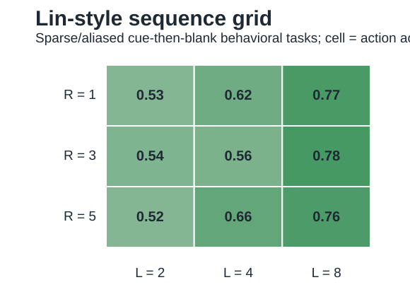
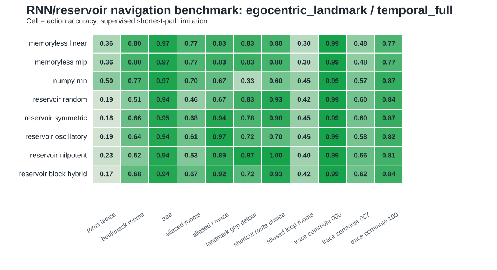

# Iteration 010: Supervised Lin Bridge

Date: 2026-05-21

## Question

Can the supervised benchmark become a closer bridge to Lin/Yiu/Leibold 2026 before moving to actor-critic RL?

## Implementation

The RNN benchmark now adds:

- behavioral task families for delayed landmark choice, landmark-gap detour, shortcut-route memory, repeated rooms, loop rooms, and bottleneck routes;
- a lightweight `egocentric_landmark` observation with local action affordances plus sparse landmark symbol;
- stratified delayed-choice splits so decision labels appear in both train and test;
- a Lin-style fixed sequence-generator family with explicit width `R`, propagation depth `L`, and span `ell = R + L - 1`;
- clean `front_bands` input injection and an `all_units` injection reference at `R = 3`, `L = 4`;
- behavioral context readout diagnostics in the Lin sequence summaries.

New outputs:

- `figures/rnn_lin_sequence_summary.csv`;
- `figures/rnn_lin_sequence_injection.csv`;
- `figures/rnn_lin_sequence_grid.svg`;
- `figures/rnn_navigation_egocentric_landmark_*`.





## Key Results

Sparse full-input mean action accuracy across the expanded task set:

```text
memoryless_linear             0.608
numpy_rnn                     0.651
reservoir_nilpotent           0.710
reservoir_orthogonal          0.707
Lin sequence front R1 L8      0.746
Lin sequence front R3 L8      0.731
```

The memory-critical behavioral cue-then-blank cases are stronger:

```text
task                    best memoryless   best recurrent/sequence   advantage
delayed T-maze          0.667             1.000                     +0.333
landmark-gap detour     0.333             1.000                     +0.667
shortcut-route choice   0.600             1.000                     +0.400
```

On sparse cue-then-blank behavioral tasks, the longer Lin-style sequence depths dominate:

```text
R   L   ell   mean action accuracy
3   8   10    0.784
1   8    8    0.772
5   8   12    0.763
1   4    4    0.616
3   2    4    0.544
1   2    2    0.528
```

For the `R = 3`, `L = 4` sparse full-input reference, front-band input injection reaches `0.683` mean accuracy versus `0.643` for all-unit injection. The effect is not universal across every temporal regime, but it directly tests the fairness concern that input injected into all hidden units can overwrite a finite sequence buffer.

## Interpretation

The supervised benchmark now represents Lin-style sequence controls explicitly rather than treating the generic nilpotent reservoir as the only sequence proxy. The important new result is a depth effect: delayed sparse behavioral choices favor longer sequence propagation `L`.

The benchmark still does not reproduce Lin 2026. It lacks actor-critic learning, continuous visual navigation, and the full trained hippocampus-inspired architecture. Its role is a controlled bridge: hold the supervised policy target fixed while varying geometry, input sparsity, and structured sequence memory.

The long-horizon correction follows in [[iteration_011_long_lin_blocks]].
