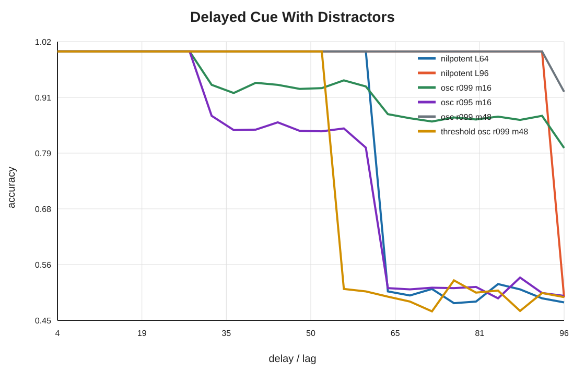

# Iteration 014: Temporal Basis Benchmark

## Question

Does the analytic distinction between nilpotent delay lines and oscillatory reservoirs show up in simple controlled tasks?

## Implementation

`experiments/temporal_basis_benchmark.py` compares:

- nilpotent delay lines with spans `L = 32, 64, 96`;
- damped oscillatory banks with `r in {0.90, 0.95, 0.99}`;
- a larger oscillatory bank with 48 modes;
- a thresholded damped oscillatory bank;
- a matched two-dimensional phase oscillator for a modulo-phase task.

Outputs:

- `figures/temporal_basis_delayed_cue.csv`
- `figures/temporal_basis_phase_task.csv`
- `figures/temporal_basis_forgetting_curves.svg`
- `figures/temporal_basis_lag_similarity.svg`
- `figures/temporal_basis_delayed_cue_accuracy.svg`
- `figures/temporal_basis_phase_task.svg`


## Result 1: Nilpotent Gives A Sharp Span Boundary

In the delayed cue with distractors, nilpotent delay lines are at ceiling inside their span and fall to chance immediately outside it. For example, `nilpotent_L32` is `1.000` through delay `28` and near chance from delay `32` onward. `nilpotent_L64` similarly falls at delay `64`.

This matches the derivation:

```text
A^k B = e_{k+1}  for k < L
A^k B = 0        for k >= L
```

The forgetting curve is a hard finite cutoff, not exponential decay.

## Result 2: Oscillation Can Solve Delay If The Basis Is Large Enough

The large damped oscillatory bank `osc_r099_m48` solves the delayed cue well despite contraction: it reaches `1.000` at delay `64` and `0.918` at delay `96`. This is not a contradiction. With enough frequencies, the readout can synthesize a narrow temporal selector from phase codes.

The calibrated conclusion is:

> Nilpotent delay is the direct basis for finite lag recall. Oscillation can approximate lag recall, but it needs enough modes, good conditioning, and sufficient remaining amplitude after damping.



## Result 3: Thresholding Is Not Equivalent To Delay Memory

The thresholded oscillatory bank is sensitive to threshold choice and can erase useful low-amplitude modes. In this run, `threshold_osc_r099_m48` is near chance at long delays. This supports the theory note's point: thresholding creates a nonlinear detection boundary, not true lag-addressed memory.

## Result 4: Oscillation Is Efficient For Phase Tasks

In the modulo-phase reconstruction task, a matched two-dimensional oscillator reaches cosine alignment `0.9999`. The 96-dimensional nilpotent line also performs well (`0.9923`) because it explicitly stores all tested lags, but shorter nilpotent spans are worse (`0.5707` for `L32`, `0.8029` for `L64`).

This supports the regime distinction:

- nilpotent is efficient for exact finite sparse-event recall;
- oscillation is efficient for cyclic or phase variables.


## Interpretation

The benchmark strengthens the theory, but it also prevents an overclaim. Oscillatory reservoirs are not weak; they are mismatched only when capacity is limited and the task requires exact finite lag addressing. With enough modes, oscillatory banks can approximate a delay selector. Conversely, nilpotent lines can solve phase tasks only by spending enough slots to store the whole lag range, which is inefficient relative to a phase-matched oscillator.

The paper-facing claim should be:

> The relevant distinction is temporal basis geometry. Nilpotent/Lin-block memory gives direct lag-addressable finite storage, while oscillatory reservoirs give phase-distributed storage. Finite cue-gap tasks favor the former; cyclic phase tasks favor the latter; sufficiently large banks can approximate the other basis at increased cost.
